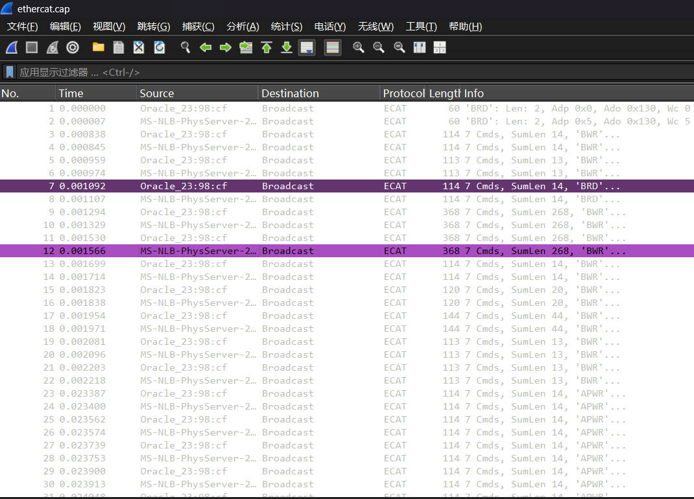
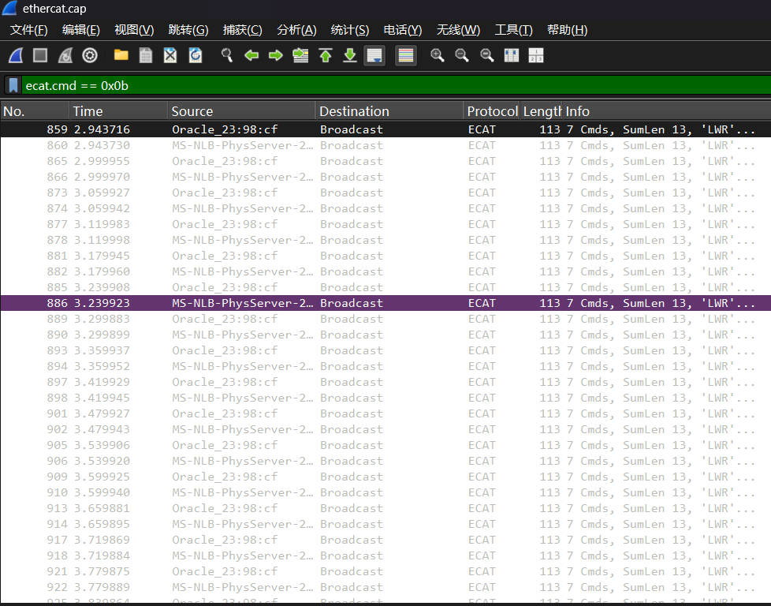
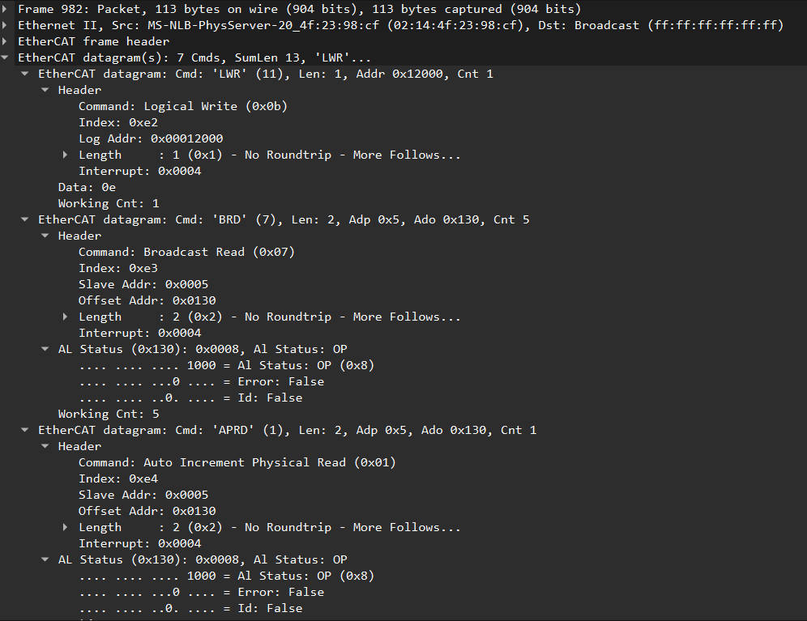

（主要是针对EtherCAT的抓包分析）

# 一、首先先看WireShark的主界面（报文列表区）

* 看时间戳 (Time)：观察报文发送的时间间隔。如果是周期性的报文，间隔是否稳定（比如每 1ms 一次）？如果有突变，说明主站可能发生了丢包或调度延迟。
* 看源和目的 (Source/Destination)：判断通信双方是谁（主站 MAC 还是从站 MAC，广播还是单播）。
* 看协议 (Protocol)：确认 Wireshark 是否成功解析。比如你的图里显示 ECAT，说明解析成功。
* 看简要信息 (Info)：这是最直观的栏目。它会直接告诉你命令类型（如 BRD、LWR、LRW）、数据长度（Len）以及工作计数器（Wc）。

# 二、学会使用显示过滤器

动辄几十万个包，不可能全看。使用显示过滤器（顶部的输入框，背景通常是浅绿色）可以筛选所关心的报文。

* 过滤协议：输入 ecat。
* 过滤命令：输入 ecat.cmd == 0x0c（只看 LRW），或者 ecat.cmd == 0x0b（只看 LWR）。
* 过滤地址：输入 ecat.adp == 0x1（只看针对1号从站的通信）。
* 过滤异常：输入 ecat.wkc == 0（只看工作计数器为0的报文，快速定位哪里通信断了）。

技巧：在报文列表里选中某一条报文，右键点击 -> Apply as Filter（作为过滤器应用） -> Selected，Wireshark 会自动生成过滤语句。

# 三、选中某条报文，看报文详情区

这里遵循 TCP/IP 或工业协议的分层模型，从上往下依次是：

1. 物理层/数据链路层（Frame, Ethernet II）：看 MAC 地址、帧长度、是否有填充（Pad）。
2. 网络层（IP）：EtherCAT 通常不经过 IP 层，是直接跑在以太网上的，所以这里经常没有。
3. 传输层/应用层（EtherCAT frame header, EtherCAT datagram）：这是你的重点。
    * 展开 EtherCAT frame header：看总帧长和类型。
    * 展开 EtherCAT datagram(s)：看每个子报文的结构。
    * 必看字段：命令（Cmd）、长度（Len）、地址（Adp/Ado/Addr）、数据（Data）、工作计数器（Working Cnt）。
    * 如果看到 Data 字段里的十六进制数据，对比一下你的设备手册（比如伺服的控制字、状态字映射表），就能知道 01 代表什么含义。

# 四、看多个报文间的关联和对比

比如看报文间周期时间差

看报文的命令状态机是否在推进

看报文的工作计数器是否在递增

等等能够佐证报文正确的逻辑链路