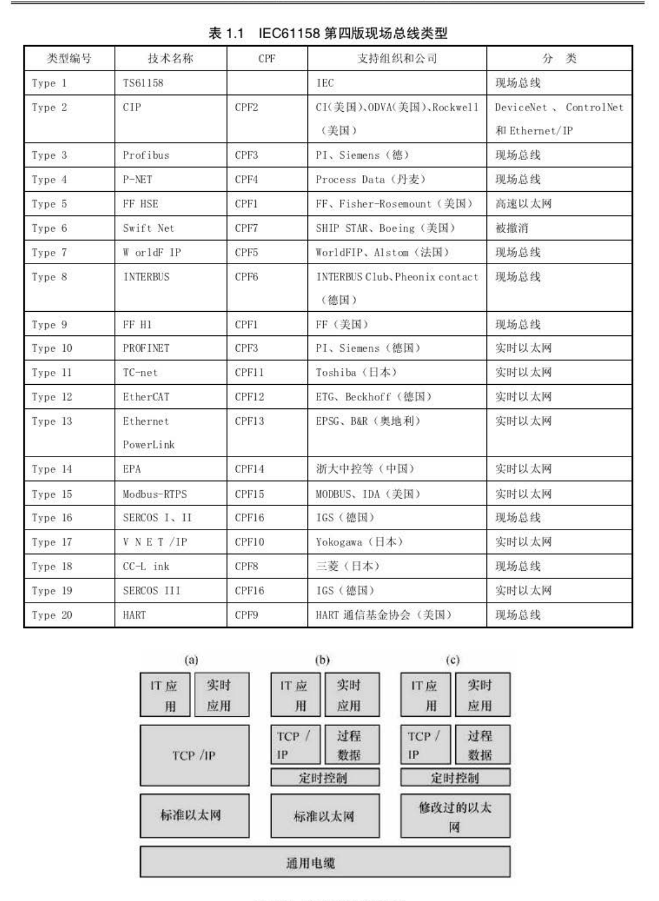
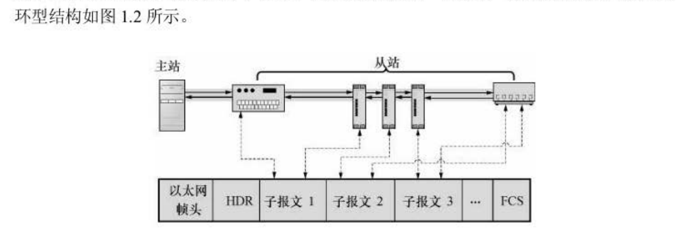

# 第1章 概述

> 本章解决的问题：**工业现场总线为什么要往"以太网"上走？以太网本来不实时，大家是怎么把它改造成实时的？EtherCAT 属于哪一派？**

---

## 1.1 工业以太网与实时性问题

**图 1.1　以太网通信模型（OSI 与 TCP/IP 对照）**（原书 p.14）

把计算机网络里的以太网技术搬到工业自动化领域，构成的工业控制以太网，就叫**工业以太网**（也叫以太网现场总线）。它是当前现场总线技术的一个重要发展方向。

它比传统现场总线好在哪？

* **传输速度快、数据包容量大、传输距离长**；
* **用通用以太网元器件**（网线、水晶头、交换机、网卡芯片都是民用级量产货），性价比高；
* **可以接入标准以太网网段**，天然能和企业信息系统打通。

### 为什么普通以太网不能直接用于工业控制？

以太网原本的介质访问控制（MAC）方式叫 **CSMA/CD**（带冲突检测的载波侦听多路访问）。通俗说就是：**谁想说话先听一听，线路空着就说，撞上了就各自退避、随机等一段时间再重说。**

这个"随机退避"就是问题所在：**它不保证谁什么时候一定能说上话**，也就是"非确定性"。而工业控制要的是"**每个 1ms 必须把这一轮数据送到，晚一点就是事故**"。

> 类比：CSMA/CD 像一群人开讨论会，谁想发言就先等等、撞车了就随机让一下。平时没问题，但如果这是个手术团队，主刀医生说"止血钳"，你不能等三秒后随机某个时刻才递过去。

所以必须对以太网做"实时化改造"。按实时性和成本，业界做法大致分**三类**：

### （1）基于 TCP/IP 的实现——"在原有协议栈上想办法"

继续使用完整的 **TCP/IP 协议栈**，靠上层调度去化解不确定性：

* **合理调度**，减少冲突的可能；
* 给数据帧**定义优先级**，实时数据给最高优先级；
* 使用**交换式以太网**（交换机端口独享带宽，基本消除冲突）。

典型协议：**Modbus/TCP、EtherNet/IP**。

**结论：实时性一般**，只能用于对实时性要求不高的过程自动化（比如监控、参数采集），做不了多轴联动的伺服控制。

### （2）基于以太网的实现——"保留硬件，绕开 TCP/IP"

仍然使用**标准的、未修改的以太网通信硬件**，但**过程数据不走 TCP/IP**。它引入一种专门的过程数据传输协议，用**特定的以太类型（EtherType）**的以太网帧直接传。

同时把一个时间控制层放在 TCP/IP 上面，给它分配**时间片**使用以太网资源——即"周期性实时数据 + 间隙跑普通 IP 数据"。

典型协议：**Ethernet Powerlink、EPA、PROFINET RT**。

**结论：实时性较高**，但距"硬实时"还有一步。

### （3）修改以太网的实现——"为实时开一条专道"

为了拿到**响应时间小于 1ms 的硬实时**，直接对以太网协议做修改：

* **从站由专门的硬件实现**；
* 在实时通道内由**实时 MAC 接管通信控制**，报文冲突被**彻底避免**；
* 通信数据处理被简化（数据链路层就直接处理，不用往上层层递交）；
* **非实时数据仍可以在开放通道里按原协议传输**（比如用邮箱传参数、下载固件）。

典型协议：**EtherCAT、SERCOS III、PROFINET IRT**。

**结论：硬实时。**

### 一句话总结三者关系

| 类型 | 做法 | 实时性 | 代表 |
| :--- | :--- | :--- | :--- |
| 基于 TCP/IP | 全套标准协议栈 + 上层调度 | 一般 | Modbus/TCP、EtherNet/IP |
| 基于以太网 | 标准硬件，过程数据绕开 TCP/IP | 较高 | Powerlink、PROFINET RT |
| 修改以太网 | 实时 MAC 接管，从站专用硬件 | **硬实时（<1ms）** | **EtherCAT**、SERCOS III |

> EtherCAT 属于第三类，而且是最"激进"的一类：它把**几乎整个协议栈都砍掉**，只留数据链路层干活。

---

## 1.2 EtherCAT 协议概述

**EtherCAT** 由德国 **BECKHOFF（倍福）** 公司于 **2003 年**提出，后成为开放的 IEC 61158 / IEC 61784 国际标准。

它的核心特点：**高速、高数据有效率、支持多种拓扑**。**从站用专用控制芯片（ESC），主站用标准以太网控制器。**

### 主要特点

1. **适用性广**：任何带商用以太网控制器的控制单元都能当 EtherCAT 主站。从 16 位小单片机到 3GHz 的 PC 系统，都可以做 EtherCAT 控制系统。
2. **完全符合以太网标准**：可以与普通以太网设备、其他协议并存在同一根线上；以太网交换机等标准组件也能用在 EtherCAT 里。
3. **无须从属子网**：极复杂的节点和只有 2 位 I/O 的极简节点，都可以做从站。
4. **效率高**：最大化利用以太网带宽传用户数据（对比一下：普通以太网一帧 1500 字节里，光 TCP/IP 头就占掉 40~60 字节，EtherCAT 的协议头只有十几个字节）。
5. **刷新周期短**：可以做到**小于 100µs** 的数据刷新周期，足以用于伺服技术中底层的**闭环控制**（电流环、速度环）。
6. **同步性能好**：各从站节点可以达到 **小于 1µs 的时钟同步精度**（实际硬件配合可达纳秒级）。

### 拓扑与物理介质

**图 1.2　EtherCAT 运行原理**（原书 p.16）

* 支持的拓扑：**线形、树形、星形**（以及它们的任意组合）。
* 物理介质：**100BASE-TX 标准以太网电缆或光缆**。
* 用 100BASE-TX 电缆时，**站间距离可达 100m**。
* **整个网络最多可连接 65535 个设备**（这是 16 位站地址决定的）。
* 使用快速以太网**"全双工"**通信技术构成**主从式**结构。

> **"主从式"是理解 EtherCAT 的第一把钥匙**：只有主站会发数据帧，从站永远是被动地"就着经过的帧顺手读写一下"。没有谁跟谁抢总线，所以不需要仲裁，也就没有冲突——这正是它能做到硬实时的根本原因。

---

## 本章小结（记住这 5 句就够）

1. 工业以太网 = 以太网 + 工业实时性改造，优点是快、便宜、能接入标准网段。
2. 普通以太网的 CSMA/CD 有随机退避，天生**非确定性**，不能直接做实时控制。
3. 实时化改造有三条路：**改上层（TCP/IP）→ 改协议（绕开 TCP/IP）→ 改硬件（实时 MAC）**。
4. **EtherCAT 走的是第三条路**，从站专用芯片，硬实时（<1ms），代表协议还有 SERCOS III、PROFINET IRT。
5. EtherCAT 由倍福 2003 年提出，主站用普通网卡、从站用专用 ESC 芯片，最多 65535 个节点，站间 100m。

---

**下一章**：[第2章 EtherCAT 协议](第2章%20EtherCAT协议.md) —— 帧长什么样、怎么寻址、怎么同步时钟、怎么在四个状态之间协商。
