# 第3章 EtherCAT 从站控制芯片（ESC）

> 上一章讲的是"协议规定要怎么做"，这一章讲的是"**哪块芯片把这些规定做成了硬件**"。
>
> 一句话主线：**ESC 就是 EtherCAT 从站的心脏——它硬件实现数据链路层协议，你只要挂个微处理器和收发器，一个从站就活了。**

---

## 开篇：ESC 是什么

**ESC**（EtherCAT Slave Controller）是实现 EtherCAT **数据链路层协议**的专用集成电路芯片。它处理 EtherCAT 数据帧，并为从站控制装置提供数据接口。

主要功能：

| 功能 | 说明 |
| :--- | :--- |
| **集成数据帧转发处理单元** | 通信性能**不受从站微处理器性能限制**。每个 ESC 最多提供 **4 个数据收发端口** |
| **最大 64KB 双端口存储器 DPRAM** | 其中 **4KB 寄存器空间** + **1~60KB 用户数据区**。可由外部微处理器用并行或串行总线访问，这个访问接口叫 **PDI**（Physical Device Interface） |
| **可以脱离微处理器独立运行** | 可作纯数字量 I/O 芯片使用，自带通信状态机处理功能，**最多提供 32 位数字量输入输出** |
| **FMMU 逻辑地址映射** | 提高数据帧利用率（见第2章 2.3.3） |
| **SyncManager（SM）通道** | 管理 DPRAM，保证应用数据的一致性和安全性 |
| **集成分布式时钟（DC）** | 为微处理器提供高精度中断信号 |
| **EEPROM 访问功能** | 存储 ESC 和应用配置参数，定义**从站信息接口 SII**（Slave Information Interface） |

> **"不受微处理器性能限制"这句话是 EtherCAT 的精髓**。用一个类比：普通现场总线里，从站微处理器是"**交通警察**"，每个报文都要它亲自看一下、再放行——CPU 慢一点，通信就慢一点。EtherCAT 里，ESC 是"**全自动收费站**"，帧不停车、ETC 直接扣费通过。**微处理器干什么？它只负责"业务"——读走输出数据、算出输入数据、写回去**。通信快慢和它完全无关。
>
> 这就是为什么 EtherCAT 从站可以只用一颗几十块钱的单片机，就能跑出微秒级通信周期。

---

## 3.1 ESC 概述

**图 3.1　ESC 结构图**（原书 p.42）

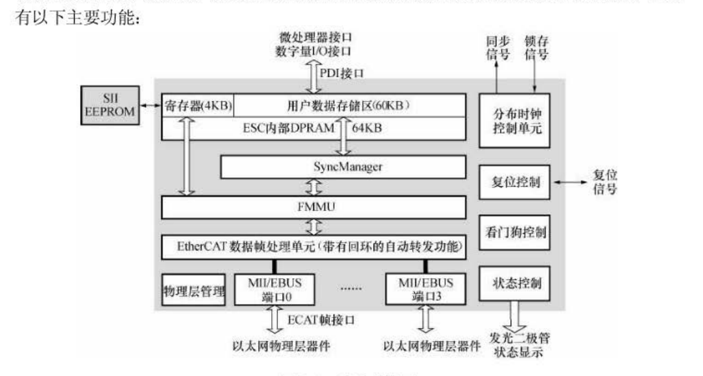

### 3.1.1 ESC 芯片种类

ESC 由德国 **BECKHOFF** 提供，包括 **ASIC 芯片**和 **IP-Core** 两种形态。

#### 两种 ASIC 从站控制专用芯片

| 特性 | **ET1100** | **ET1200** |
| :--- | :--- | :--- |
| 端口数 | **4 个**端口，支持 EBUS 或 MII | **3 个**端口，最多 1 个 MII 端口 |
| FMMU 单元 | 8 | 3 |
| 存储同步管理单元（SM） | 8 | 4 |
| 过程数据 RAM | **8KB** | 1KB |
| 分布式时钟 | **64 位** | 32 位 |
| PDI 接口 | 32 位数字量 IO；8/16 位异步/同步微处理器接口 **MCI**；SPI | 16 位数字量 IO；**SPI** |
| EEPROM 容量 | 16kbit | 16kbit ~ 4Mbit |
| 封装 | BGA128，10×10mm | QFN48，7×7mm |

> **怎么选**：**ET1100 是"标准款"**——4 个端口、8 个 FMMU/SM、8KB 过程数据 RAM、64 位 DC，伺服驱动器和复杂从站都用它。**ET1200 是"精简款"**——管脚少、封装小、便宜，适合**简单的 I/O 模块**（比如一个 16 点的远程 IO 盒）。
>
> 记住一句话：**端口数决定它能怎么接线；FMMU 数决定它能映射多少个过程数据段；SM 数决定它能开几条数据通道；RAM 决定它能缓存多少过程数据。**

#### IP-Core 形态

用户也可以使用 **IP-Core** 把 EtherCAT 通信功能**集成到自己的设备控制 FPGA 中**，并根据需要配置功能和规模（如 Altera Cyclone 系列 FPGA 的 ET18xx IP-Core）：

* 端口数：**2 个 MII 或 RMII** 端口（可配置）
* FMMU 单元：**0~8 个可配置**
* 存储同步管理单元：**0~8 个可配置**
* 过程数据 RAM：**1~60KB 可配置**
* 分布式时钟：可配置
* PDI：32 位数字量 IO、8/16 位异步/同步微处理器接口、SPI、**Avalon/OPB 片上总线**

> **IP-Core 的价值**：你不用在板子上多放一颗芯片（省成本、省面积），而且**"要几个 FMMU/SM、要多少 RAM"可以按需裁剪**。如果你的设备本身就用 FPGA 做主控，直接塞进去，从站和安全功能共用一个芯片。

### 3.1.2 ESC 存储空间

**图 3.2　ESC 内部存储空间示意图**（原书 p.44）

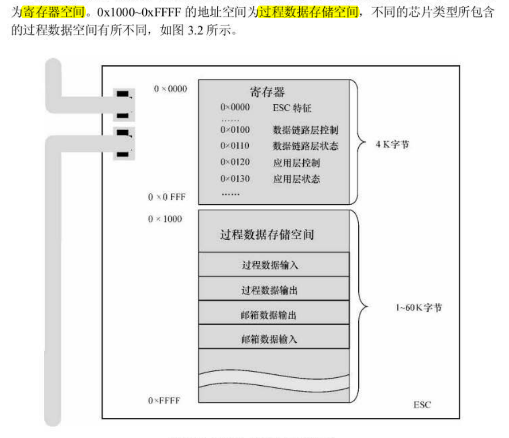

ESC 有 **64KB 的 DPRAM 地址空间**：

```
0x0000 ┌──────────────────────────┐
       │  寄存器空间（4KB）        │
       │  ESC 特征信息   0x0000    │
       │  数据链路层控制 0x0100    │
       │  数据链路层状态 0x0110    │
       │  应用层控制     0x0120    │
       │  应用层状态     0x0130    │
0x0FFF └──────────────────────────┘
0x1000 ┌──────────────────────────┐
       │  过程数据存储空间（1~60KB）│
       │  过程数据输入             │
       │  过程数据输出             │
       │  邮箱数据输出             │
       │  邮箱数据输入             │
0xFFFF └──────────────────────────┘
```

#### 一个非常关键的设计：寄存器有缓存区，用户区没有

* **0x0000~0x0F7F 的寄存器带缓存区**：ESC 收到写寄存器的数据帧时，数据**先存在缓存区**。只有**确认数据帧接收正确（FCS 校验通过）**，缓存区的值才会被真正写进寄存器；否则整个丢弃。
* **用户和过程数据存储区没有缓存区**：对它写操作**立即生效**。
* 如果数据帧接收错误，ESC **不会**向上层应用控制程序通知存储区数据改变。

> **为什么这样设计**：寄存器是"**设备的操作面板**"——比如 AL 控制寄存器决定从站切到什么状态。要是帧收坏了还把半个命令写进去，设备可能跑到一个谁也没打算要的状态。所以**寄存器操作必须"要么全对，要么不做"**。
>
> 过程数据不一样，它**每个周期都会被整个刷新一遍**，偶尔一帧坏了下一帧就纠正回来了，为了这点可靠性去做缓存不划算——**性能和简单性优先**。

#### 存储空间一览（按功能块）

| 地址范围 | 功能块 | 典型寄存器 |
| :--- | :--- | :--- |
| 0x0000~0x000F | **ESC 信息** | 类型、版本号、内部标号、FMMU 数、SM 数、RAM 大小、端口描述、特性 |
| 0x0010~0x0013 | **站点地址** | 配置站点地址、配置站点别名 |
| 0x0020~0x0031 | **写保护** | 寄存器写使能 / 写保护（ESC、EEPROM） |
| 0x0040 | **ESC 复位** | 主复位控制 |
| 0x0100~0x0103 | **数据链路层** | DL 响应、物理读/写偏移、DL 控制 |
| 0x0110~0x0111 | | **DL 状态**（PDI 运行、看门狗、端口链路/环路/通信状态） |
| 0x0120~0x0121 | **应用层** | **AL 控制**（主站写，请求状态） |
| 0x0130~0x0131 | | **AL 状态**（从站回，实际状态） |
| 0x0134~0x0135 | | **AL 状态码**（出错原因） |
| 0x0140~0x0153 | **PDI** | PDI 控制、PDI 配置、SYNC/LATCH 接口配置、扩展 PDI 配置 |
| 0x0200~0x0201 | **中断** | ECAT 帧中断请求/屏蔽 |
| 0x0204~0x0207 | | AL 事件请求屏蔽 |
| 0x0210~0x0211 | | ECAT 帧中断请求 |
| 0x0220~0x0223 | | **AL 事件请求**（微处理器靠它知道发生了什么） |
| 0x0300~0x0313 | **错误计数** | 各端口无效帧/接收错误/转发错误计数、处理单元错误、PDI 错误、链接丢失计数 |
| 0x0400~0x0443 | **看门狗** | 分频、PDI 看门狗、过程数据看门狗及状态 |
| 0x0500~0x0518 | **EEPROM / MII** | EEPROM 接口、MII 管理接口、PHY 地址/寄存器/数据、PHY 端口状态 |
| **0x0600~0x06FF** | **FMMU 配置** | FMMU[15:0]，每个占 16 字节 |
| **0x0800~0x087F** | **SM 配置** | SM[15:0]，每个占 8 字节 |
| **0x0900~0x09FF** | **分布式时钟** | DC 接收时间、系统时间、偏移/延迟/漂移、SYNC 单元、Latch 单元、SM 同步 |
| 0x0E00~0x0EFF | **ESC 特征寄存器** | 如产品/厂商 ID |
| 0x0F00~0x0FFF | **数字量 I/O 与用户 RAM** | 32 位数字量输出、通用输出/输入、用户 RAM/扩展特性 |
| 0x1000~0xFFFF | **过程数据 RAM** | 数字量 I/O 输入、过程数据 RAM |

> **建议只记住 5 个地址**（其余用到再查手册）：
> **0x0120 AL 控制 / 0x0130 AL 状态 / 0x0134 AL 状态码**（状态机三件套）、**0x0220 AL 事件请求**（微处理器的"事件通知栏"）、**0x0600 FMMU / 0x0800 SM**（配置区）。

### 3.1.3 ESC 特征信息

**ESC 寄存器空间的前 10 个字节就是它的"身份证"**——主站读这几个字节就能知道芯片类型和能力：

| 地址 | 名称 | 描述 | 典型值 |
| :--- | :--- | :--- | :--- |
| 0x0000 | **类型** | 芯片类型 | ET1100 = **0x11**；ET1200 = **0x12** |
| 0x0001 | **修订号** | 芯片版本修订号 | 与 ESC 相关 |
| 0x0002~0x0003 | **内部版本号** | 内部版本号 | 与 ESC 相关 |
| 0x0004 | **FMMU 支持** | FMMU 单元数目 | ET1100 = **8**；ET1200 = **3** |
| 0x0005 | **SM 支持** | SM 通道数目 | ET1100 = **8**；ET1200 = **4** |
| 0x0006 | **RAM 大小** | 过程数据存储区容量（单位 KB） | ET1100 = **8**；ET1200 = **1** |
| 0x0007 | **端口配置** | 4 个物理端口的用途（每 2 位一个端口）：`00` 没有实现、`01` 没有配置、`10` EBUS、`11` MII | — |

> **这张表非常实用**：写一个通用从站驱动时，**第一步就该读这几个字节**——先问芯片"你有几个 FMMU？几条 SM？多少 RAM？"，再决定后面怎么配置。这就叫**"能力发现"**，比写死参数强得多。

---

## 3.2 ESC 芯片 ET1100

**图 3.3　ET1100 结构框图**（原书 p.51）

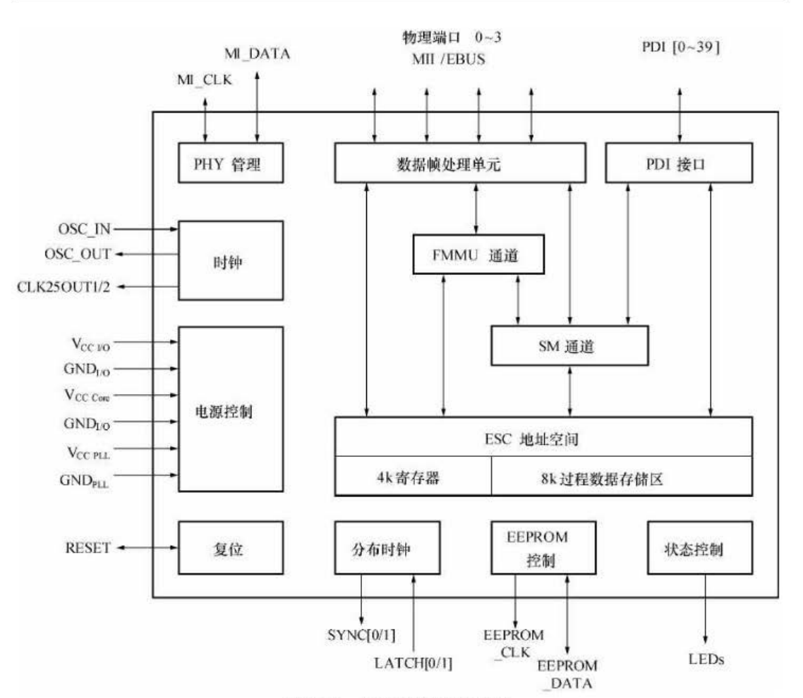

### 3.2.1 ET1100 引脚定义

**图 3.4　ET1100 芯片 BGA128 封装的引脚分布**（原书 p.52）

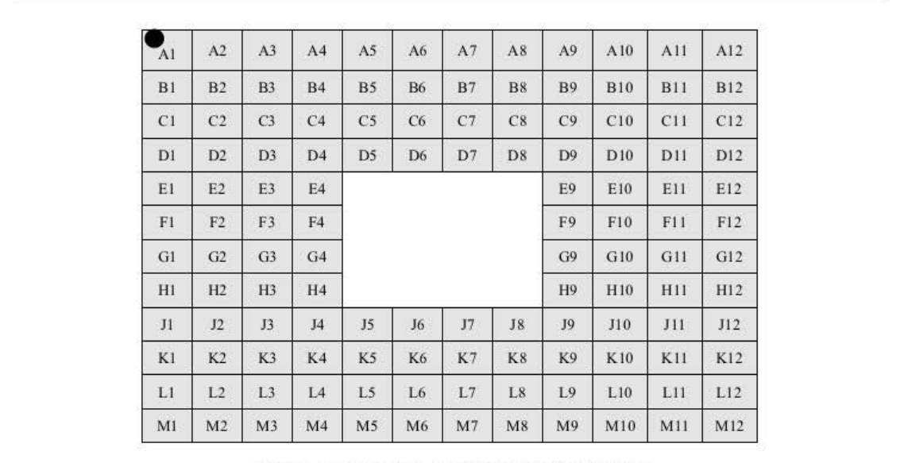

引脚大致分四组（详见厂商数据手册，这里只抓分类）：

| 分组 | 内容 |
| :--- | :--- |
| **物理通信接口（MII）** | 两个 MII 端口的收发引脚 + PHY 管理接口（MI_CLK / MI_DATA）+ 时钟输出 |
| **PDI 接口** | 8/16 位数据线、地址线、片选/读/写/忙等控制线（接微处理器） |
| **配置引脚** | 上电时被锁存，决定芯片工作方式 |
| **电源与地** | 多组 VCC/GND（core / IO / PLL 分开） |

### 3.2.2 物理通信接口

**图 3.7　端口 0 的 MII 接口示意图**（原书 p.58）

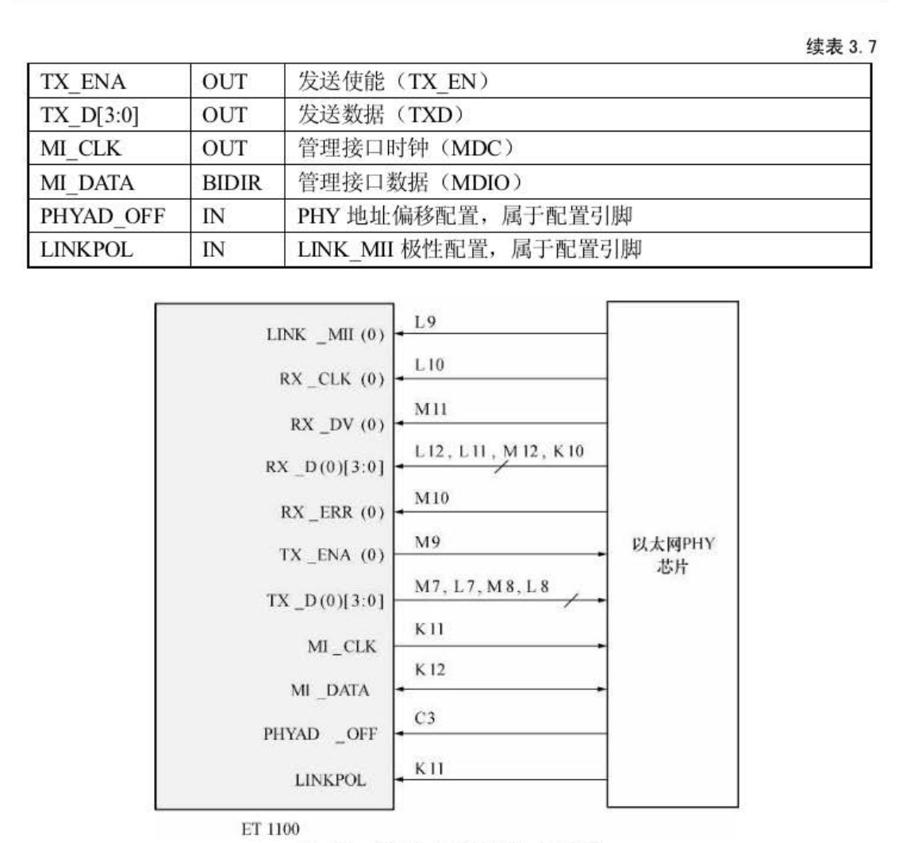

**图 3.8　EBUS 接口信号**（原书 p.59）

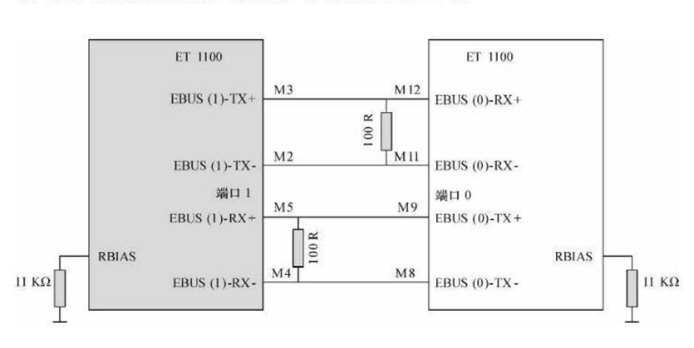

ET1100 支持两种物理层接口模式：**MII** 和 **EBUS**（见第2章 2.1.2 的对比表：MII ≈500ns/端口、EBUS ≈100ns/端口、EBUS 最大 10m）。

**MII 接口的关键要求**（这也是第4章 PHY 选型的依据）：

* 两个 MII 端口各自有 `TX_ENA`、`TX_D[0..3]`、`TX_CLK`、`RX_DV`、`RX_ERR`、`RX_CLK`、`RX_D[0..3]`；
* `LINK_MII(n)` 引脚由 PHY 指示"有效连接"；
* `CLK25OUT1` 输出 25MHz 时钟给 PHY；
* **MI 管理接口**（`MI_CLK` / `MI_DATA`）用于读写 PHY 内部寄存器——**注意 MI_CLK 引脚同时用作配置输入引脚，所以不能固定接上拉/下拉**（第4章会再强调）。

> **MII 为什么有 20 多根线**：它是 4 位宽的数据总线 + 独立的收发时钟，也就是"**并行小水管**"。相比之下 EBUS 用 LVDS 差分串行，线少、延时低，但距离短。**一个要跑 100 米，一个只在同一排模块之间传**——它们解决的根本不是同一个问题。

### 3.2.3 PDI 接口

**图 3.9　数字量输入／输出信号**（原书 p.60）

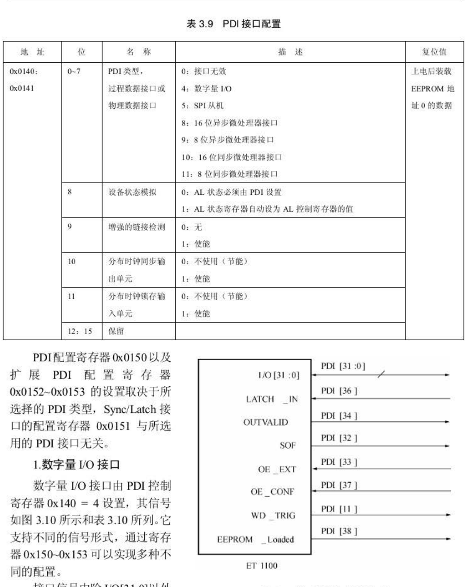

**图 3.10　数字 I/O 双向模式原理**（原书 p.62）

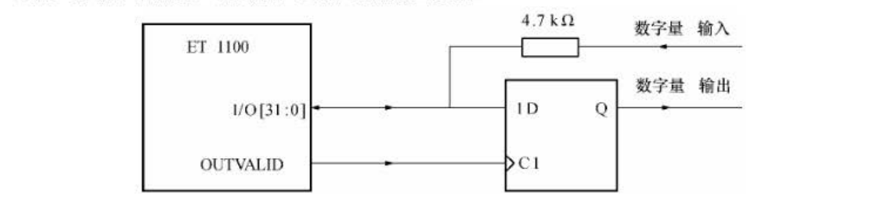

**图 3.11　SPI 主机和从机连接图**（原书 p.63）

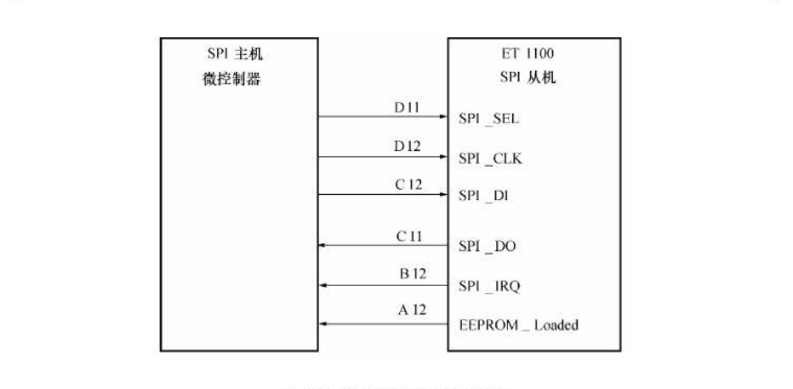

**图 3.12　8 位异步微处理器与 ET1100 的数据接口**（原书 p.64）

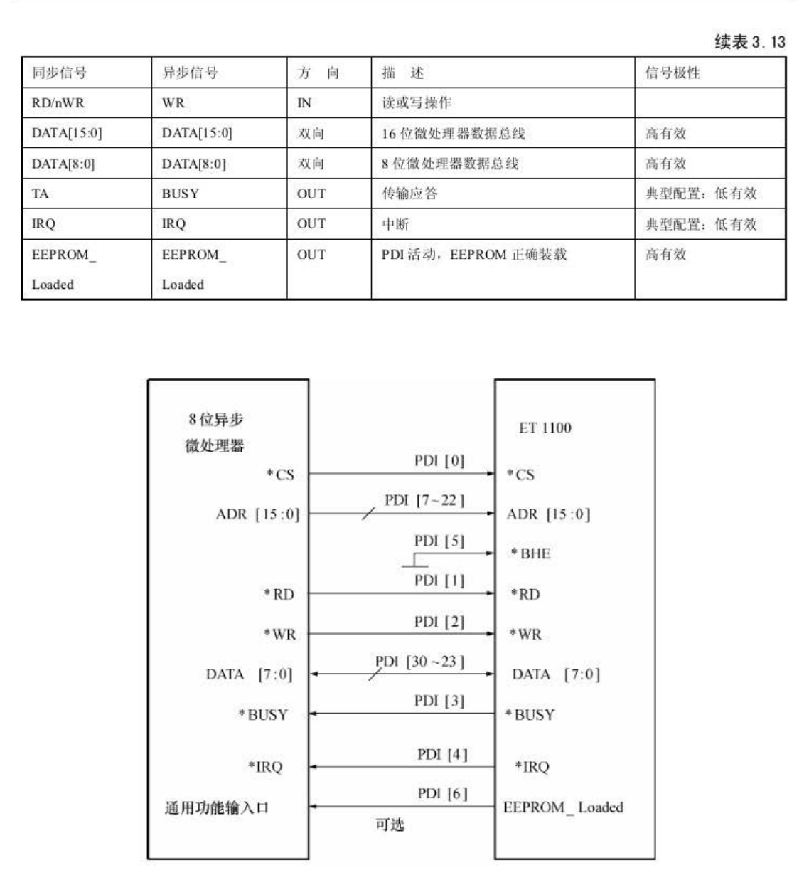

**图 3.13　16 位异步微处理器与 ET1100 的数据接口**（原书 p.65）

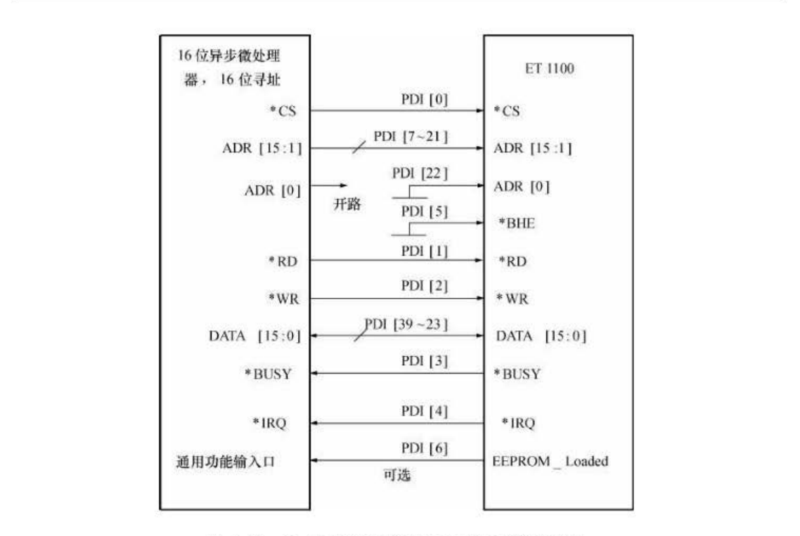

**图 3.14　16 位同步微处理器使用字节选择信号操作 ET1100**（原书 p.65）

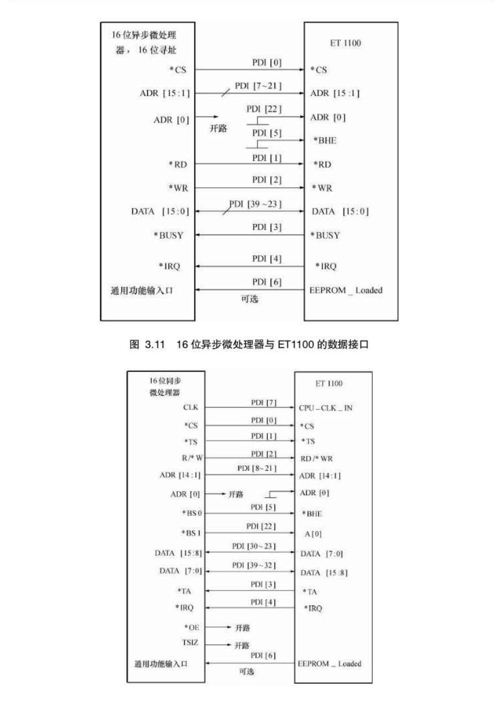

PDI（Physical Device Interface）是**ESC 与从站本地微处理器之间的接口**，ET1100 提供几种形态：

| PDI 形态 | 说明 | 适用 |
| :--- | :--- | :--- |
| **数字量 I/O** | 最多 **32 位**数字量输入输出，**不需要微处理器** | 最简单的远程 I/O 模块 |
| **8/16 位异步/同步微处理器接口（MCI）** | 挂到单片机/CPU 总线上，像访问一片 RAM | 需要做控制算法的从站（伺服、模拟量模块） |
| **SPI** | 串行外设接口，引脚少 | 小型/低引脚数设备 |

### 3.2.4 / 3.2.5 配置引脚与其它引脚

**图 3.5　ET1100 使用石英晶体作为时钟源时的连接**（原书 p.57）

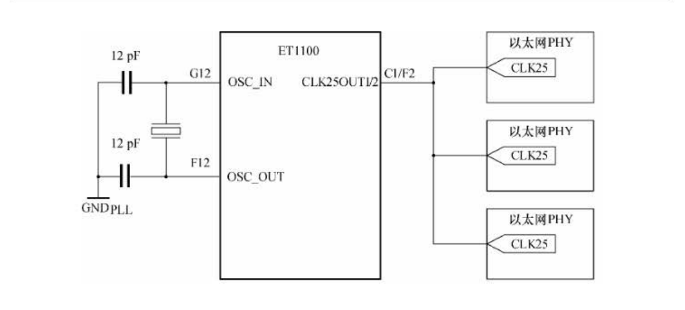

**图 3.6　ET1100 使用外部振荡器作为时钟源输入时的连接**（原书 p.57）

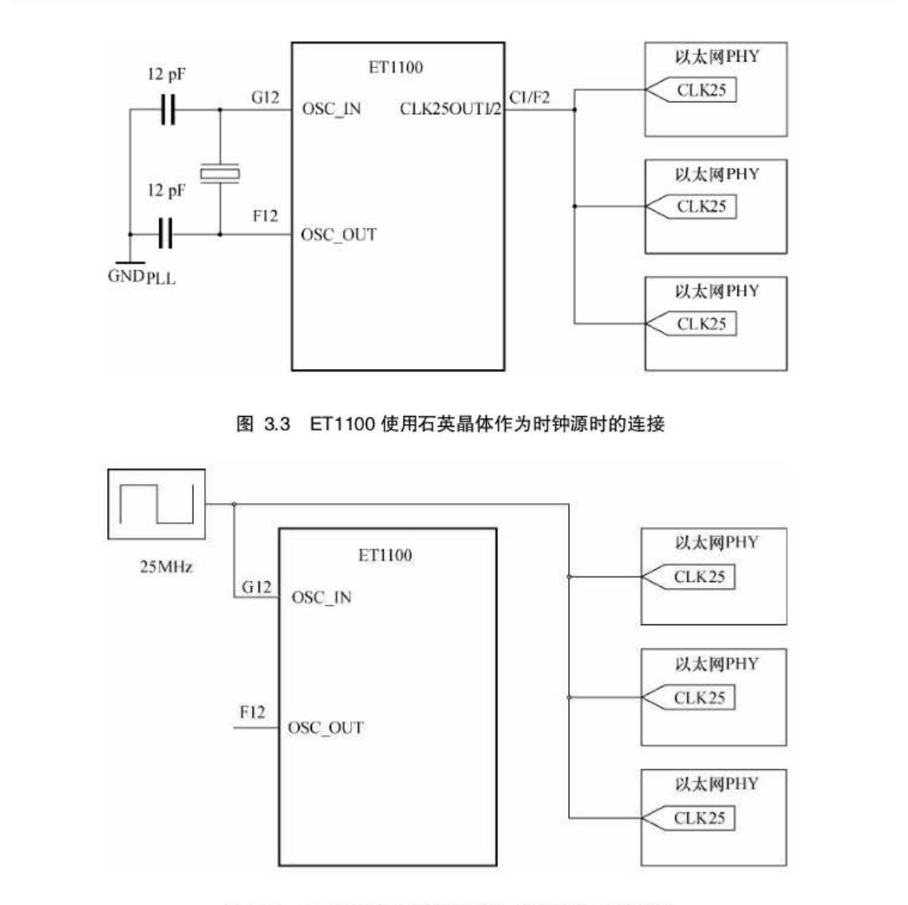

**图 3.15　ET1100 复位引脚连接图**（原书 p.68）

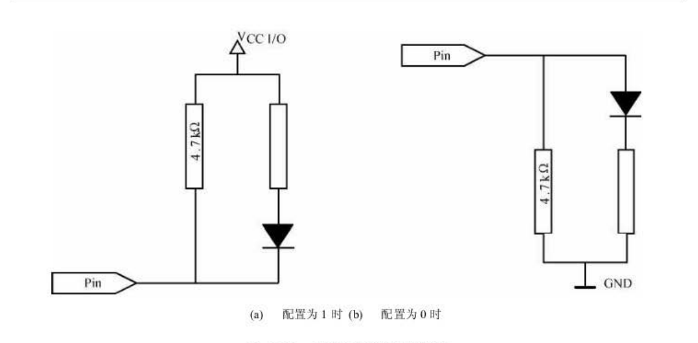

**图 3.16　ET1100 供电连接**（原书 p.69）

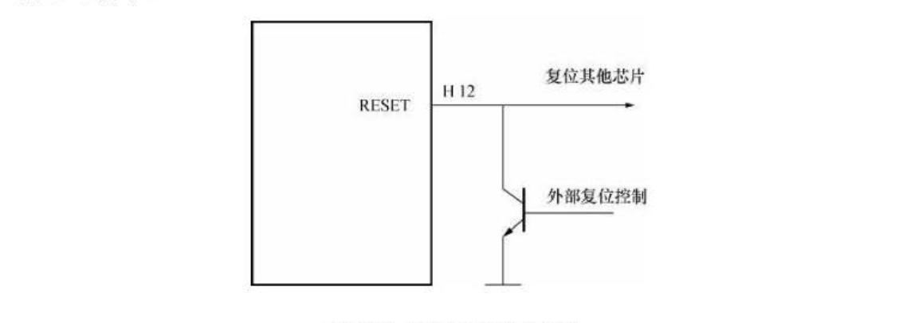

**配置引脚的核心特性：与 PDI 引脚或其他引脚复用，上电时作为输入被 ET1100 锁存，上电后恢复正常的操作功能。**

这就是为什么第4章要强调**"上电瞬间这些引脚的电平决定了 ESC 的脾气，之后再改就跑偏了"**。典型的配置项包括（详见第4章 4.2.2 表）：

* 端口用 **MII** 还是 EBUS；
* 是否**输出 CPU 时钟**；
* MII TX 是否有**相位偏移**；
* **PHY 地址是否有偏移**；
* **LINK_MII 的极性**（低有效还是高有效）；
* EEPROM 容量大小。

> **最容易踩的坑**：配置引脚用 4.7kΩ 电阻上拉/下拉决定取值，**如果你为了别的用途又给这个引脚接了别的电路（比如 LED），上电瞬间的电平就可能被拉偏，ESC 就配置成了另一个模式**。表现症状通常是"**PHY 通不上电、链路起不来**"或者"**端口极性反了**"——非常不好查。所以设计时**一定要先确认哪些引脚是上电复用的配置脚**。

---

## 3.3 ESC 数据链路控制

### 3.3.1 ESC 数据帧处理

**图 3.17　ESC 内部数据帧传输顺序**（原书 p.69）

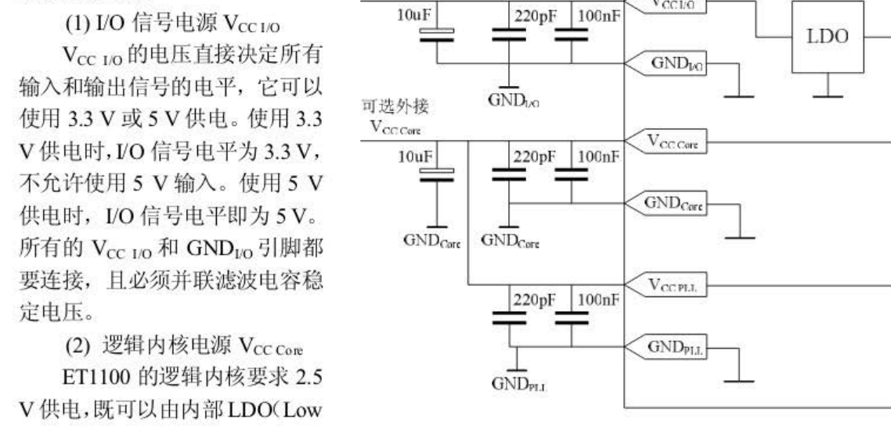

ESC 收到帧后按固定路径走：**端口 0 进 → 3 → 1 → 2 → 0 出**（第2章 2.1.2）。数据帧处理单元负责：

* 识别 EtherCAT 子报文，交给 FMMU 判断是否匹配；
* 匹配则按命令做读 / 写 / 读改写；
* 累加 WKC；
* 更新子报文状态位。

### 3.3.2 ESC 通信端口控制

**端口由主站控制，从站微处理器不操作数据链路。**

**端口被打开**的条件（满足任一）：

* DL 控制寄存器中端口设为**自动**时，端口上有**活动的连接**；
* 回路设为**自动闭合**时，端口上建立连接，并且**向 0x0100 相应控制位再次写入 0x01**；
* 回路设为自动闭合时，端口上建立连接，并且**收到有效的以太网数据帧**；
* 回路设为**常开**。

**端口被闭合**的条件（满足任一）：

* 端口不可用或没有被使能；
* 回路设为自动时，端口上**没有活动的连接**；
* 回路设为自动闭合时，端口没有活动连接，或者建立连接后**没有再次写入 0x01**；
* 回路设为**常闭**。

**还有一个"救命机制"**：当所有端口（不管因为强制还是自动）都处于闭合状态时，**端口 0 将自动打开作为"恢复端口"**。可以通过它做读/写操作来改正 DL 控制寄存器的设置，此时 DL 状态寄存器仍然反映正确状态。

> **把它想成机房的门禁**：如果一个从站因为配置错误把自己"锁死"了（所有端口都关了），主站就再也联系不上它。**所以硬件必须保证永远留一扇后门**——这就是端口 0 的恢复端口。**任何可靠的现场总线都有这种"防砖"设计**，不然现场一次误操作就得派人去拆机。

### 3.3.3 数据链路错误检测

ESC 在**两个功能块**中检测错误：

| 检测模块 | 能检测的错误 |
| :--- | :--- |
| **自动转发模块** | 物理层错误（RX 错误）、数据帧过长、**CRC 校验错误**、数据帧无以太网起始符 SOF |
| **EtherCAT 数据帧处理单元** | 物理层错误、数据帧长度错误、数据帧过长、数据帧过短、CRC 校验错误、**非 EtherCAT 数据帧**（当 0x0100.0=1 时） |

**错误计数器**（都在 0x0300~0x0313）：

| 地址 | 名称 |
| :--- | :--- |
| 0x0300 + i×2 | 端口 i 无效帧计数 |
| 0x0301 + i×2 | 端口 i 接收错误计数 |
| 0x0308 + i | 端口 i 转发错误计数 |
| 0x030C | 数据帧处理单元错误计数 |
| 0x0310 + i | 端口 i 链接丢失计数 |

**注意：所有计数器的最大值都是 0xFF**，计数到 0xFF 后**停止，不再循环计数**，必须由写操作消除（写 0x0300~0x030B 中的任意一个即可清除该组全部值）。

> **"计数到 0xFF 就停"是个很聪明的设计**：它不追求精确计数（反正也溢出），而是追求**"这里出过问题"这个事实能被保留下来**。运维时看到某个端口的错误计数是 0xFF，就知道"**这里一定出过事，而且不止 255 次**"——足够定位问题了，而且不需要 32 位计数器。

### 3.3.4 ESC 数据链路地址

**设置寻址**时有两种从站地址模式，用不同寄存器：

| 地址 | 名称 | 说明 |
| :--- | :--- | :--- |
| **0x0010~0x0011** | **配置站点地址** | **设置寻址使用的地址**（供 FPRD、FPWR、FPRW 命令用） |
| **0x0012~0x0013** | **配置站点别名** | 是否使用这个别名取决于 **DL 控制寄存器（0x0100~0x0103）的位 24** |

**（1）由主站在数据链路启动阶段配置**

主站在**初始化状态**时，用 **APWR** 命令写从站寄存器 0x0010~0x0011，为从站设置一个与连接位置无关的地址，后续运行即可用它访问从站。

**（2）由从站上电初始化时从自身配置数据区装载**

每个 ESC 都配有一块 **EEPROM**，里面存了配置数据，其中包括一个**站点别名**。ESC 上电初始化时自动装载，把站点别名写入 0x0012~0x0013。主站在链路启动阶段用顺序寻址命令 **APRD** 读取各从站的别名，后续使用。**使用别名之前，主站还需要设置 DL 控制寄存器 0x0100~0x0103 的位 24 等于 1**，通知从站将用站点别名进行设置寻址。

> **用别名有什么好处**：**即使网段拓扑改变、或者中间加/减了设备，从站仍然可以用同一个设置地址被访问**。
>
> 类比：主站配置的站地址像"**临时按排队顺序发的号牌**"——队伍一变，号就乱了。而别名存在每个从站自己的 EEPROM 里，像"**身份证号**"——**无论你站在队伍哪个位置，扫身份证都知道是你**。所以别名在**需要更换/增减设备的产线**上特别有价值。

### 3.3.5 逻辑寻址控制

EtherCAT 子报文可以用逻辑寻址访问 ESC 内部存储空间，ESC 用 **FMMU 通道**实现逻辑地址映射。每个 FMMU 通道使用 **16 个字节**配置寄存器，从 **0x0600** 开始。

| 偏移 | 位 | 名称 | 说明 |
| :--- | :--- | :--- | :--- |
| +0x0~0x3 | 0~31 | **数据逻辑起始地址** | 在 EtherCAT 地址空间内的逻辑起始地址 |
| +0x4~0x5 | 0~15 | **数据长度（字节数）** | 从第一个映射字节到最后一个映射字节的偏移 + 1（映射 2 个字节则该值为 2） |
| +0x6 | 0~2 | **逻辑起始位** | 映射区起始位 |
| +0x7 | 0~2 | **逻辑停止位** | 映射区终止位 |
| +0x8~0x9 | 0~15 | **从站物理内存起始地址** | 物理起始地址 |
| +0xA | 0~2 | **物理内存起始位** | 物理起始位 |
| +0xB | 0 | 读操作控制 | 0 = 无读访问映射，1 = 使用读访问映射 |
| | 1 | 写操作控制 | 0 = 无写访问映射，1 = 使用写访问映射 |
| +0xC | 0 | **激活** | 0 = 不激活 FMMU；1 = 激活，则检查映射配置并执行映射的地址访问 |
| +0xD~0xF | | 保留 | |

> **"逻辑起始位 / 停止位"为什么要单独存在**：因为 FMMU **可以按位映射**。这样主站的**一个字节里可以塞 8 个不同从站的开关量**——位 0 给从站 A，位 1 给从站 B……**帧里一个字节当 8 个用**，这就是第2章说的"报文利用率高"的具体来源。

---

## 3.4 ESC 应用层控制

### 3.4.1 状态机控制和状态

**主站和从站按以下三步规则执行状态转化**：

1. **主站**要改变从站状态时，把**目的状态**写入从站 **AL 控制位（0x0120.0~3）**；
2. **从站**读到新状态请求后检查自身状态：
   * 可以转化 → 把**新状态**写入状态机**实际状态位（0x0130.0~3）**；
   * 不能转化 → **不改变实际状态位**，设置**错误指示位（0x0130.4）**，并把**错误码**写入 **0x0134~0x0135**；
3. **主站**读状态机实际状态（0x0130）：
   * 正常转化 → 执行下一步；
   * 出错 → 读错误码，并写 **AL 错误应答（0x0120.4）**来消除 AL 错误指示。

#### 寄存器位含义

| 地址 | 位 | 名称 | 取值 |
| :--- | :--- | :--- | :--- |
| **0x0120** | 0~3 | **AL 控制位**（主站写） | 1 = 请求初始化状态；2 = 请求预运行状态；3 = 请求 Bootstrap 状态；4 = 请求安全运行状态；8 = 请求运行状态 |
| | 4 | AL 错误应答 | 0 = 无错误应答；1 = 应答 AL 状态寄存器中的错误 |
| **0x0130** | 0~3 | **从站状态实际状态**（从站写） | 1 = 初始化；2 = 预运行；3 = Bootstrap；4 = 安全运行；8 = 运行 |
| | 4 | AL 错误指示 | 0/1：是否处在请求的状态或标志被消除 |

#### 一个重要的握手细节

使用微处理器 PDI 接口时，**AL 控制寄存器由握手机制操作**：

> **ECAT 帧写完 AL 控制寄存器后，PDI 必须执行一次（读一下），否则 ECAT 帧不能继续写操作。只有在复位后 ECAT 帧才能恢复写 AL 控制寄存器。**

如果 PDI 是**数字量 I/O** 模式，从站没有外部微处理器去读 AL 控制寄存器，此时主站要设置**设备模拟位 `0x0140.8 = 1`**，ESC 就会**自动把 AL 控制寄存器的值复制到 AL 状态寄存器**。

> **"PDI 必须读一下"这条看着奇怪，其实是握手协议**：主站写"请切到 Safe-Op"→ ESC 把这个请求放进寄存器 → 从站程序必须**读一下表示"我收到了"** → ESC 才允许主站下一次写。
>
> 目的很明确：**防止主站连写好几个状态请求，把从站程序搞得来不及处理**。就像你给同事连发三条微信"改一下 A""改一下 B""改一下 C"，他还没看第一条你就改了主意——**有了"已读回执"，你就知道该等他处理完再发下一条**。
>
> 而"设备模拟位"是给**没有微处理器的纯 I/O 模块**准备的：没人读那就自动应答，不然主站永远发不出第二条。

#### AL 状态码（常见条目）

| 编码 | 描述 | 产生错误的状态/转化 | 结果状态 |
| :--- | :--- | :--- | :--- |
| 0x0000 | 无错误 | 任意 | 当前状态 |
| 0x0001 | 未知错误 | 任意 | 任意 + E |
| 0x0011 | 无效状态改变请求 | I→S、I→O、P→O、O→B、S→B、P→B | 当前状态 + E |
| 0x0012 | 未知状态请求 | 任意 | 当前状态 + E |
| 0x0013 | 不支持引导状态 | I→B | I + E |
| 0x0014 | 固件程序无效 | I→P | I + E |
| 0x0015 | 无效的邮箱配置 | I→B | I + E |
| 0x0016 | 无效的邮箱配置 | I→P | I + E |
| 0x0017 | 无效 SM 通道配置 | P→S、S→O | 当前状态 + E |
| 0x0018 | 无有效的输入数据 | O、S、P→S | P + E |
| 0x0019 | 无有效的输出数据 | O、S→O | S + E |
| 0x001A | 同步错误 | O、S→O | S + E |
| 0x001B | **SM 看门狗** | O、S | S + E |
| 0x001C | 无效的 SM 类型 | O、S / P→S | S + E / P + E |
| 0x001D | 无效的输出配置 | O、S / P→S | S + E / P + E |
| 0x001E | 无效的输入配置 | O、S、P→S | P + E |
| 0x001F | 无效的看门狗配置 | O、S、P→S | P + E |
| 0x0020 | 从站需要冷启动 | 任意 | 当前状态 + E |
| 0x0021 | 从站需要 Init 状态 | B、P、S、O | 当前状态 + E |
| 0x0022 | 从站需要 Pre-Op | S、O | S+E、O+E |
| 0x0023 | 从站需要 Safe-Op | O | O + E |
| 0x0030 | 无效的 DC SYNC 配置 | O、S | S + E |
| 0x0031 | 无效的 DC 锁存配置 | O、S | S + E |
| 0x0032 | PLL 错误 | O、S | S + E |
| 0x0042~0x004F | **EoE / CoE / FoE / SoE / VoE 邮箱通信错误** | B、P、S、O | 当前状态 + E |

（表中 "+E" 表示设置了 AL 错误指示位 0x0130.4）

> **这张表是排障神器**。举个最常见的例子：**主站想切到 Op，结果切不过去，读到 AL 状态码 = 0x0019「无有效的输出数据」**——这说明**从站发现自己的输出 SM 里没有有效数据**。原因通常是：主站忘了先发一帧有效的输出数据就请求 Op 了，或者 SM2 的输出通道没配置对。**看状态码比盲猜快十倍。**

### 3.4.2 中断控制

ESC 支持两种中断，另外同步信号也能当微处理器中断：

| 中断类型 | 方向 | 说明 |
| :--- | :--- | :--- |
| **（1）PDI 中断** | ESC → 本地微处理器 | 所有 AL 事件请求都映射到 **0x0220~0x0223**，由**事件屏蔽寄存器 0x0204~0x0207** 决定哪些事件触发 **IRQ** 信号。微处理器响应后在中断服务程序里读 AL 事件请求寄存器，按事件做处理 |
| **（2）ECAT 帧中断** | ESC → 主站 | 用来通知**主站**从站发生的 AL 事件。它借助 **EtherCAT 子报文头中的状态位**传输 **ECAT 中断请求寄存器 0x0210~0x0211** 的内容；由**中断屏蔽寄存器 0x0200~0x0201** 决定哪些事件会被写进状态位并送给主站 |
| **（3）SYNC 信号中断** | DC → 微处理器 | 同步信号可以映射到 IRQ 触发中断；**IRQ 信号约 40ns 抖动，同步信号只有约 12ns 抖动**。所以也可以把 SYNC 信号**直接接到微处理器的中断引脚**，让微处理器快速响应同步 |

#### AL 事件请求寄存器（0x0220~0x0223）常见位

| 位 | 事件 | 说明 |
| :--- | :--- | :--- |
| 0 | **AL 控制事件** | 从站写了 AL 控制寄存器（即主站请求状态切换） |
| 1 | **Latch 输入** | Latch 输入至少改变一次 |
| 2 | **SYNC0 状态** | 需 0x0151.3 = 1 才有效，读 0x098E.0 消除 |
| 3 | **SYNC1 状态** | 需 0x0151.4 = 1 才有效，读 0x098F.0 消除 |
| 4 | **SM 激活寄存器变化** | 至少一个 SM 变化，读 SM 激活寄存器消除 |
| 8 | **SM 状态锁存** | SM 通道 0~3 的状态位映射 |
| 9 | **SM 事件等待处理** | 有 SM 事件等待处理 |

（ECAT 帧中断请求 0x0210~0x0211 的位类似：位 0 缓存事件、位 2 DL 状态事件、位 3 AL 状态事件、位 4 每个 SM 状态变化）

> **为什么同步信号要直接接中断引脚**：**40ns 抖动 vs 12ns 抖动**，差了 3 倍多。多轴插补时 40ns 的抖动可能直接反映成轨迹误差。**能省掉一级就省掉一级**——这是精度上的"抠门"，但在运动控制里值得。

### 3.4.3 看门狗控制

ESC 支持两种内部看门狗：

#### （1）过程数据看门狗（监测过程数据刷新）

* 通过设置 **SM 控制寄存器（0x0804 + N×8）的位 6** 使能相应的过程数据看门狗；
* **定时器值（0x0420~0x0421）设为 0 将使看门狗无效**；
* 过程数据缓存区被刷新后，看门狗**重新开始计数**；
* **超时后触发**：
  * 设置过程数据看门狗状态寄存器（0x0440.0 = 0）；
  * **数字量 I/O 的 PDI 接口收回数字量输出数据，不再驱动输出信号或拉低输出信号**；
  * 过程数据看门狗超时计数寄存器（0x0442）增加。

#### （2）PDI 看门狗（监测 PDI 运行）

* 一次**正确的 PDI 读写操作**可以启动 PDI 看门狗重新计数；
* 定时器值（0x0410~0x0411）设为 0 将使看门狗无效；
* **超时后触发**：
  * 设置 ESC DL 状态寄存器 0x0110 的 PDI 看门狗位，并把 DL 状态变化映射到 ECAT 帧中发给主站；
  * PDI 看门狗超时计数寄存器（0x0443）值增加。

#### 相关寄存器

| 地址 | 名称 | 说明 | 默认值 |
| :--- | :--- | :--- | :--- |
| 0x0400~0x0401 | 看门狗分频率 | 设定看门狗计数分频率 | **2498 ≈ 100µs** |
| 0x0410~0x0411 | PDI 看门狗定时器 | 基本看门狗计数单元计数值 | 0x03E8 |
| 0x0420~0x0421 | 过程数据看门狗定时器 | 同上 | 0x03E8 |
| 0x0440 | 过程数据看门狗状态 | 0 = 超时 | 0 |
| 0x0441 | 过程数据看门狗运行/未使能 | 1 = 未使能 | — |
| 0x0442 | 过程数据看门狗超时计数 | 达到 0xFF 停止，写操作后消除 | 0 |
| 0x0443 | PDI 看门狗超时计数 | 同上 | 0 |

> **过程数据看门狗是 EtherCAT 最重要的一道"安全阀"**。
>
> 场景：主站程序崩了 / 网线被老鼠咬断了。此时从站**收不到新的输出数据**。如果没有看门狗，从站会**继续保持上一次的输出值**——一台电机可能就以最后的转速一直转下去。这在现场是致命的。
>
> 有了它，超时后**数字量输出被直接收回（不驱动或拉低）**，**设备自动回到安全状态**。所以业内的说法是：**"EtherCAT 从站真正决定安全的不是主站，是这颗看门狗。"** 做伺服或安全模块时，这几个寄存器一定要按应用需求认真配。

---

## 3.5 存储同步管理（SyncManager，SM）

### 3.5.1 概述

**图 3.18　SM 通道缓存区分配**（原书 p.70）

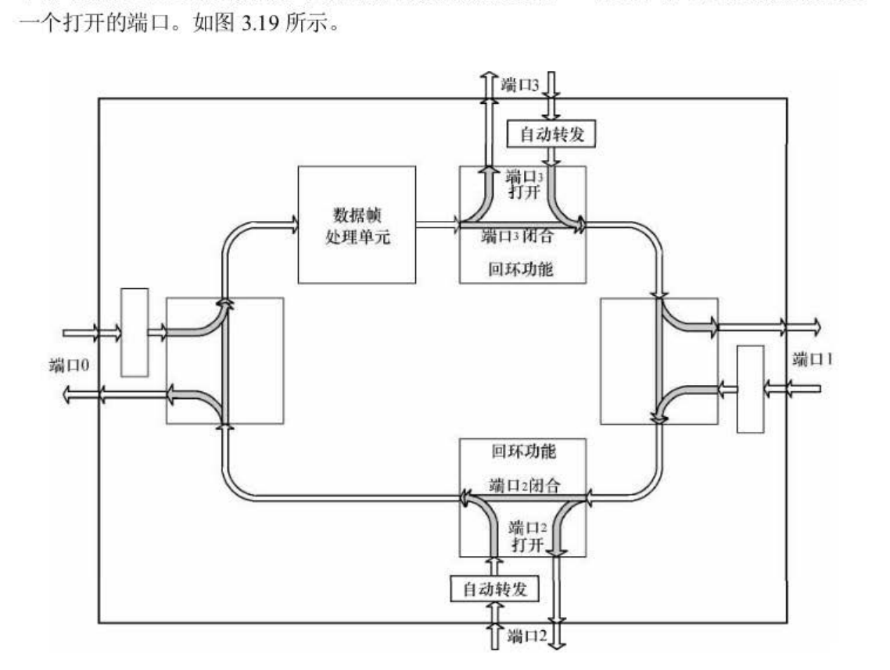

**要解决的问题**：ESC 里的存储区被**两个主人**同时访问——**EtherCAT 主站**（从网线那边读写）和**本地微处理器**（从 PDI 那边读写）。如果不管，就会出错：

* 微处理器读到"写了一半"的数据；
* 主站的新数据覆盖了微处理器还没读走的旧数据。

两个主人**必须轮询存储器**来判断另一端是否完成访问——但光靠"看标志位"很难做对。所以 ESC 用了 **SM 通道（SyncManager）**来保证一致性和安全性，并在数据状态改变时**产生中断**通知双方。

**SM 的工作方式**：把存储空间组织为一定大小的**缓存区**，**由硬件控制**对缓存区的访问。**缓存区的数量和数据交换方向可配置**。

**SM 由主站配置**。配置寄存器从 **0x0800** 开始，**每个通道 8 个字节**（含配置寄存器和状态寄存器）。

| 偏移 | 位 | 名称 | 说明 |
| :--- | :--- | :--- | :--- |
| +0x0~0x1 | 0~15 | **数据物理起始地址** | SM 处理的第一个字节在 ESC 地址空间内的起始地址 |
| +0x2~0x3 | 0~15 | **数据长度** | 分配给 SM 的数据长度，**必须大于 1，否则 SM 将不被激活**（设为 1 时只使能看门狗） |
| +0x4 | 0~1 | **运行模式** | `00` = 3 个缓存区模式；`10` = 单个缓存区模式 |
| | 2~3 | 方向 | `00` = 读（ECAT 帧读操作 / PDI 写操作） |
| | 4 | ECAT 帧中断请求 | 0 = 不使能，1 = 使能 |
| | 5 | PDI 中断请求 | 0 = 不使能，1 = 使能 |
| | 6 | **看门狗触发** | 0 = 不使能，1 = 使能 |
| +0x5 | 0 | 写事件 | 1 = 写操作成功后触发中断；读第一个字节后消除 |
| | 1 | 读事件 | 1 = 读操作成功后触发中断；写第一个字节后消除 |
| | 3 | 单缓存区状态 | 0 = 缓存区空闲，1 = 缓存区满 |
| | 4~5 | 三缓存区模式状态 | `00` 缓存区 1、`01` 缓存区 2、`10` 缓存区 3、`11` 没有写入缓存区 |
| +0x6 | 0~7 | **ECAT 帧访问 SM 激活** | 0 = SM 不使能；1 = SM 使能，映射逻辑地址的内存访问 |
| | 1 | ECAT 主站请求 | 请求 ECAT 主站数据传输 |
| | 6 | ECAT 帧访问事件锁存 | 1 = 主站写一个缓存区后产生锁存 |
| | 7 | PDI 访问事件锁存 | 1 = PDI 写一个缓存区起始地址时产生锁存 |
| +0x7 | 0 | 使 SM 无效 | 读和写含义不同：读 0 = 正常、1 = SM 无效；写 0 = 激活 SM、1 = 请求 SM 无效 |

**操作规则（重要）**：

* **必须从起始地址开始操作一个缓存区**，否则操作被拒绝；
* 操作起始地址之后，就可以操作整个缓存区；**允许再次操作起始地址，并且可以分多次操作**；
* 操作**结束地址**表示缓存区操作结束，随后缓存区状态改变，同时可以产生中断信号或看门狗触发脉冲；
* **不允许在一个数据帧内两次操作结束地址**。

> **"必须从起始地址开始"看着很别扭，但它是个很聪明的防错机制**：它相当于一个**开锁动作**——你先去"起始地址"报个到，硬件才认定"哦，你要动这块区域了"，然后才允许你写。这样任何**半路插进来的写操作**（比如主站配置错了地址、或者程序有 bug 写偏了）会被直接拒绝，而不会悄悄改坏数据。
>
> 就像图书馆借书：**你必须先扫借书证（起始地址），才能把书拿走**。绕过借书证直接从书架上偷，是拿不出去的。

### 3.5.2 缓存类型数据交换（3 个缓存区模式）

**图 3.19　SM 缓存区运行原理（3 个缓存区模式）**（原书 p.83）

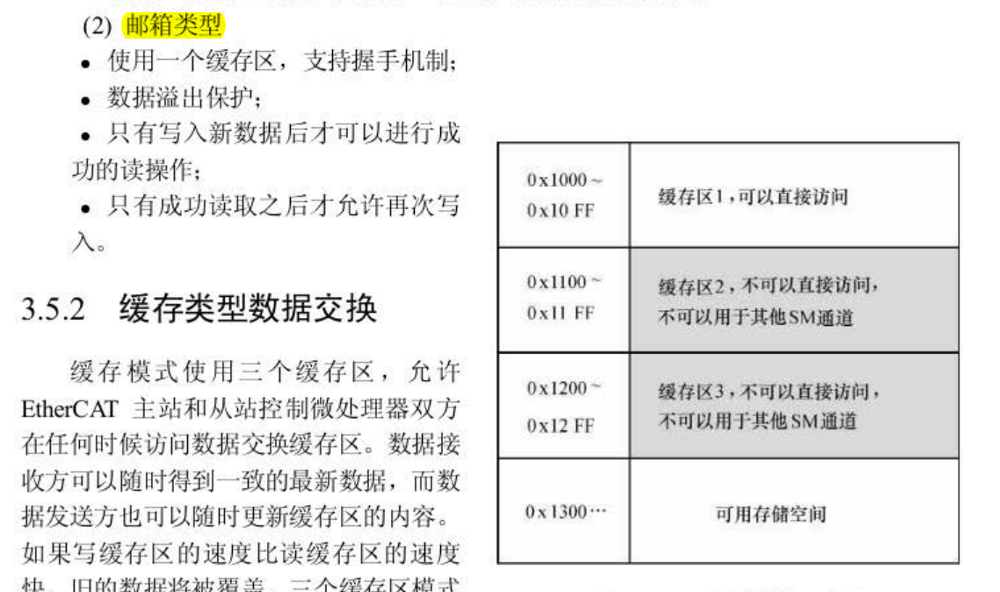

**常用于周期性过程数据通信。**

* 使用 **3 个缓存区**，保证可以**随时接收和交付最新的数据**；
* 经常有一个**可写入的空闲缓存区**；
* 第一次写入之后，经常有一个**连续可读的数据缓存区**；
* 主站和本地微处理器**双方在任何时候**都能访问数据交换缓存区；
* 数据接收方可以随时得到**一致的最新数据**，发送方也可以随时更新；
* **如果写缓存区的速度比读缓存区快，旧的数据将被覆盖**（这正是过程数据想要的行为——过程数据要的永远是"最新的"，不是"全部的"）。

**物理布局**：三个缓存区由 SM 统一管理，但 **SM 只配置了第一个缓存区的地址范围**，根据 SM 通道状态，对第一个缓存区的访问会被**重新定向**到三个缓存区中的一个。

**第二和第三个缓存区的地址范围不能被其他 SM 使用。**

**举例**：配置一个 SM 通道，起始地址 0x1000、长度 0x100，则：

```
0x1000 ~ 0x10FF  缓存区1  可以直接访问
0x1100 ~ 0x11FF  缓存区2  不可以直接访问，不可用于其他 SM
0x1200 ~ 0x12FF  缓存区3  不可以直接访问，不可用于其他 SM
0x1300 ~         可用存储空间
```

**运行过程**（三方轮转）：

| 情况 | 缓存区 1 | 缓存区 2 | 缓存区 3 |
| :--- | :--- | :--- | :--- |
| ① | 主站数据帧正在**写入** | 空闲 | 从站微处理器正在**读走** |
| ②（主站写完） | 与缓存区 2 **交换** | ← | 从站仍在读 |
| ③（从站读完） | 缓存区 3 **空闲并与缓存区 1 交换** | | |

此后主站和微处理器又可以分别开始写和读。

如果 SM 控制寄存器中使能了 ECAT 帧或 PDI 中断，那么**每次成功的读写操作**都会在 SM 状态寄存器中设置中断事件请求，并映射到 ECAT 帧中断请求寄存器和 AL 事件请求寄存器，再由相应的中断屏蔽寄存器决定是否映射到数据帧状态位或触发中断信号。

> **为什么是 3 个而不是 2 个缓存区**：2 个缓存区时，一旦主站正在写 A、微处理器正在读 B，**两边就都被占住了**，必须等其中一方完成才能交换——中间会有一段"谁也动不了"的空窗。**3 个缓存区永远留一个当"周转位"**，让两边**永远都能立刻动手**。
>
> 就像两张乒乓球台的球馆只能打一场双打，三张台就永远有人能上场。**代价是多一倍 RAM，换来的是零等待。**

### 3.5.3 邮箱数据通信机制

**图 3.20　邮箱数据通信机制**（原书 p.84）

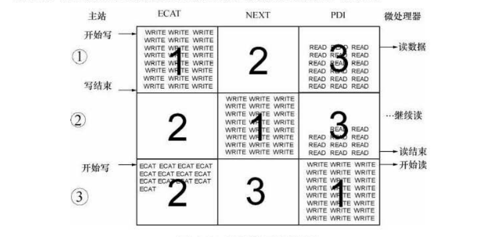

**邮箱模式使用一个缓存区，带握手机制，所以不会丢失数据。**

* 只有在**一端完成数据操作之后**，另一端才能访问缓存区；
* 发送方写缓存区 → 缓存区**被锁定为只读** → 直到接收方把数据读走 → 发送方才能再次写，同时缓存区对接收方锁定；
* **邮箱模式只允许以轮流方式读和写**，实现完整的数据交换；
* 通常用于**应用层非周期性数据交换**（参数读写、固件下载），这一个缓存区也叫"邮箱"；
* **只有 ESC 接收数据帧 FCS 正确时，SM 通道的数据状态才会改变**，这样在数据帧结束之后缓存区状态立刻变化。

**邮箱通信使用两个 SM 通道**：

| 通道 | 方向 |
| :--- | :--- |
| **SM0** | 主站 → 从站 |
| **SM1** | 从站 → 主站 |

它们都被配置成**一个缓存区**方式，**使用握手来避免数据溢出**。

#### （1）主站写邮箱操作

主站发送 ECAT 帧命令写从站的 **SM0** 所管理的缓存区地址。邮箱头里有 **Ctr（计数器）**——用于重复检测的顺序编号，**每个新的邮箱服务加 1**。

数据帧返回主站后，主站检查 WKC：

* **WKC = 1** → 写 SM0 成功；
* **WKC = 0** → SM0 **非空**，从站还没把上次写的数据读走，本次写失败 → **等一段时间后重发相同的数据帧**（用相同的 Ctr），再次判断。如果从站期间读走了数据，则本次成功。

**如果写邮箱数据帧丢失**：主站发现接收返回帧**超时**后重发相同数据帧；从站读取数据后发现里面的 **Ctr 与上次相同**，就判定这是**重复的邮箱数据**，丢弃即可。

> **Ctr 用来防重复，思路非常省**：它不需要序号确认机制、不需要序列号窗口，只在邮箱头里放 **4 位**，就让从站能识别"**这条我处理过了**"。
>
> 注意这是"**幂等性**"的思路——"就算你发两遍，结果也和我处理一遍一样"。**分布式系统里最可靠的容错方式往往不是防止重发，而是让重发变得无害。**

#### （2）主站读邮箱操作

**所有数据交换都是由主站发起的**。如果从站有数据要发给主站，必须**先把数据写入输入邮箱**，等主站来读。

---

## 3.6 从站信息接口（SII）

ESC 用 **EEPROM** 存储设备相关信息，这套信息就叫**从站信息接口 SII**（Slave Information Interface）。容量 **1Kbit ~ 4Mbit**，取决于 ESC 规格。

### 3.6.1 EEPROM 内容

**图 3.21　EEPROM 数据布局**（原书 p.85）

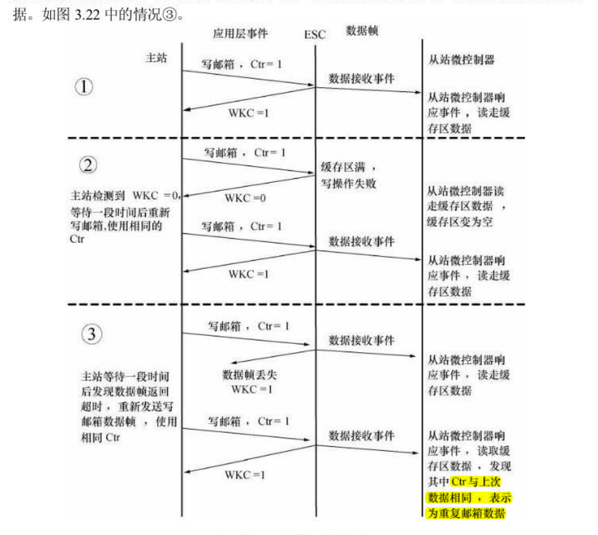

**图 3.22　EEPROM 分类数据结构图**（原书 p.87）

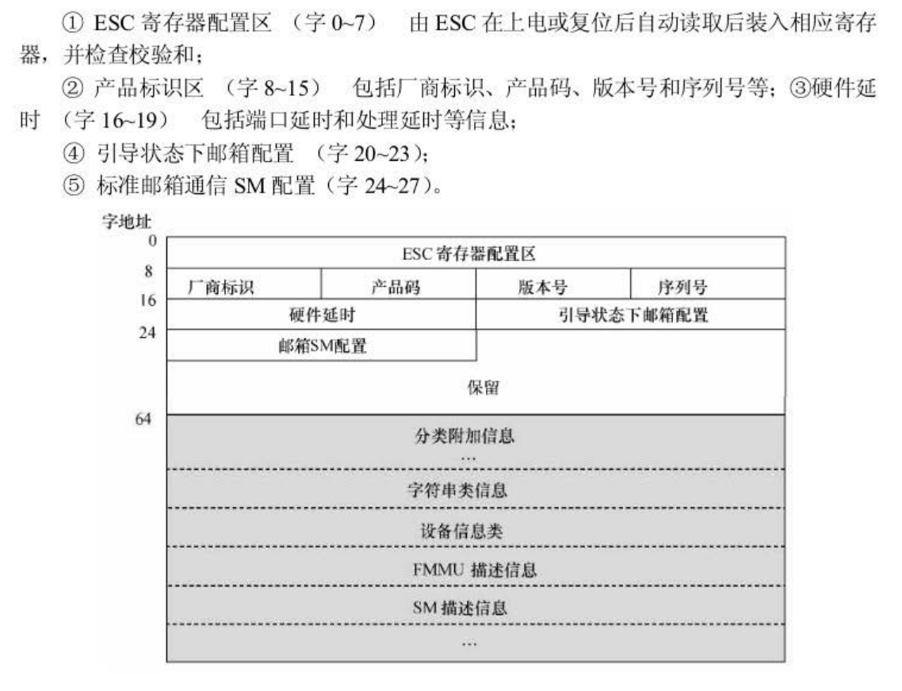

EEPROM 使用**字地址**，**字 0~63 是必须的基本信息**：

| 字地址 | 内容 |
| :--- | :--- |
| **0~7** | **ESC 寄存器配置区**——ESC 在上电或复位后**自动读取**并装入相应寄存器，并**检查校验和**（字 7 = 字 0~6 的校验和） |
| **8~15** | **产品标识区**——厂商标识、产品码、版本号、序列号等 |
| **16~19** | **硬件延时**——端口延时和处理延时等信息 |
| **20~23** | 引导状态下邮箱配置 |
| **24~27** | **标准邮箱通信 SM 配置** |
| 64 起 | **分类附加信息** |

**ESC 配置区数据（字 0~7）**：

| 字地址 | 数据名 | 描述 |
| :--- | :--- | :--- |
| 0 | PDI 控制 | PDI 控制寄存器初始值（0x0140~0x0141） |
| 1 | PDI 配置 | PDI 配置寄存器初始值（0x0150~0x0151） |
| 2 | SYNC 信号脉冲宽度 | SYNC 脉冲寄存器初始值（0x0982~0x0983） |
| 3 | 扩展 PDI 配置 | 扩展 PDI 配置寄存器初始值（0x0152~0x0153） |
| 4 | 站点别名 | 站点别名配置寄存器初始值（0x0012~0x0013） |
| 5、6 | 保留 | 保留，值为 0 |
| 7 | **校验和** | 字 0~6 的校验和 |

**分类附加信息**：包含可选的从站信息，有**标准类型**和**制造商定义类型**。所有分类数据都使用相同的数据结构：**一个字的数据类型 + 一个字的数据长度 + 数据内容**。

| 类型名 | 数值 | 描述 |
| :--- | :--- | :--- |
| STRINGS | 10 | 文本字符串信息 |
| General | 30 | 设备信息 |
| FMMU | 40 | FMMU 使用信息 |
| SyncM | 41 | 存储同步管理运行模式 |
| TxPDO | 50 | TxPDO 描述 |
| RxPDO | 51 | RxPDO 描述 |
| DC | 60 | 分布式时钟描述 |
| End | 0xFFFF | 分类数据结束 |

> **SII 是主站"认出从站"的唯一依据**。主站扫描总线时就靠它拿到：这颗从站是什么产品、需要几个 SM、RxPDO/TxPDO 怎么映射、DK 怎么配。
>
> **所以做从站硬件时有一步绝不能漏：用厂商工具（如 Beckhoff 的 SSC 工具）生成并烧写正确的 EEPROM 内容。** 固件写得再好，**EEPROM 里的 SII 不对，主站根本不知道该怎么跟你说话**——典型症状是"扫得到一个设备，但显示成未知设备、PDO 一个都没有"。这是初学者最常卡住的地方之一。

### 3.6.2 EEPROM 访问控制

ESC 具有读写 EEPROM 的功能。主站或 PDI 通过读写 ESC 的 **EEPROM 控制寄存器**来读写 EEPROM：**在复位状态下由主站控制，之后可以移交给 PDI 控制**。

**访问权分配**：寄存器 **0x0500** 和 **0x0501** 分配访问控制权：

* `0x0500.0 = 0` 且 `0x0501.0 = 0` → 由**主站**控制（**ESC 默认状态**）；
* 否则由 **PDI** 控制。

**双方在使用 EEPROM 之前都要检查访问权限。**权限移交有**主动放弃**和**被动剥夺**两种形式：

1. 主站操作结束后，主动写 `0x0500.0 = 1`，把接口**移交**给 PDI；
2. PDI 想操作时，写 `0x0501.0 = 1`，**接管**控制；
3. PDI 完成后写 `0x0501.0 = 0`，**释放**；
4. 主站写 `0x0500.0 = 0`，**收回**控制权；
5. **如果 PDI 没有主动释放，主站可以写 `0x0500.1 = 1`，强制清除 `0x0501.0`，从 PDI 手中夺回控制权**。

**EEPROM 接口支持 3 种操作命令**：写一个 EEPROM 地址、从 EEPROM 读、从 EEPROM **重载 ESC 配置**。

**读/写操作步骤**：

1. **检查 EEPROM 是否空闲**（0x0502.15 是否为 0），不空闲则等待；
2. **检查是否有错误**（0x0502.13 / 0x0502.14），有错则写 `0x0502.[10:8] = 000` 消除错误；
3. 写 EEPROM **字地址**到地址寄存器；
4. 如果要写，先把要写的数据写入**数据寄存器 0x0508~0x0509**；
5. **写控制寄存器启动命令**：
   * 读操作：写 `0x0500.8 = 1`；
   * 写操作：写 `0x0500.0 = 1` 且 `0x0500.9 = 1`——**这两位必须由同一个数据帧写完成**（用 0x0500.0 作写使能位实现**写保护机制**，它对同一数据帧中的 EEPROM 命令有效，随后**自动清除**；PDI 访问控制不需要写这一位）；
   * 重载操作：写 `0x0500.10 = 1`；
6. **主站发起的读写操作在数据帧结束符 EOF 之后才开始执行；PDI 发起的操作则马上执行**；
7. 等待**繁忙位**消除（0x0502.15 是否为 0）；
8. 检查**错误位**。如果 EEPROM 应答丢失，可以**重新发起命令**（回到第 5 步）。**重试之前要等一段时间，让 EEPROM 有足够时间保存内部数据**；
9. **获得执行结果**：
   * 读操作 → 数据在 0x0508~0x050F，**长度可以是 2 或 4 个字，取决于 0x0502.6**；
   * 重载操作 → ESC 配置被重新写入相应寄存器。

**EEPROM 控制寄存器的位含义**：

| 地址 | 位 | 名称 | 说明 |
| :--- | :--- | :--- | :--- |
| 0x0500 | 0 | EEPROM 访问分配 | 0 = ECAT 帧分配，1 = PDI 操作时释放 |
| 0x0501 | 0 | PDI 操作 | 0 = PDI 释放，1 = PDI 正在操作 |
| 0x0502 | 0~15 | 控制/状态 | — |
| 0x0503 | 0 | ECAT 帧写使能 | 0 = 写请求无效，1 = 使能写请求 |
| | 6 | 数据字节数 | 0 = 4 个字节（ET1100），1 = 8 个字节（ET1200 等） |
| | 7 | EEPROM 地址字节 | 0 = 1 个地址字节（1KBit~16KBit），1 = 2 个地址字节（32KBit~4MBit） |
| | 8 | 读命令位 | 写 1 = 开始读操作 |
| | 9 | 写命令位 | 写 1 = 开始写操作 |
| | 10 | 重载命令位 | 写 1 = 开始重载操作 |
| | 11 | ESC 配置区校验 | 0 = 校验和正确，1 = 校验和错误 |
| | 12 | 设备信息校验 | 0 = 信息正确，1 = 从 EEPROM 装载设备信息错误 |
| | 13 | 命令应答 | 0 = 无错误，1 = EEPROM 无应答或命令无效 |
| | 14 | 写使能错误 | 0 = 无错误，1 = 请求写命令时无写使能 |
| | 15 | **繁忙位** | 0 = EEPROM 接口空闲，1 = EEPROM 接口繁忙 |
| 0x0504~0x0507 | 0~31 | **EEPROM 地址** | 请求操作的 EEPROM 地址，**以字为单位** |
| 0x0508~0x050F | 0~15 / 16~63 | **EEPROM 数据** | 要写入的数据 / 从 EEPROM 读到的数据（高位字；一次读 4 个字节时只有 16 位有效） |

> **"写操作必须由同一个数据帧写 0x0500.0 和 0x0500.9"这条要求，是一个经典的"防误写"设计。**
>
> 相当于保险柜的**双钥匙**：光有"我要写"（9）不行，还得在**同一次操作里**同时给出"我有写权限"（0）。因为写使能位**自动清零**，所以**不可能出现"上次遗留的写权限被这次误用到"的情况**。
>
> **为什么 EEPROM 要这么小心**：EEPROM 的写入寿命有限（通常 100 万次），而且里面存的是**SII**——烧坏了设备就"不认识自己"了。所以宁可多一道手续。

### 3.6.3 EEPROM 操作错误处理

错误由 **0x0502~0x0503** 指示：

| 位 | 名称 | 描述 | 原因 / 解决方法 |
| :--- | :--- | :--- | :--- |
| 11 | 校验和错误 | ESC 配置区校验和错误，使用 EEPROM 初始化的寄存器保持原值 | 原因：CRC 错误；解决：检查 CRC |
| 12 | 设备信息错误 | ESC 配置没有被装载 | 原因：校验和错误、应答错误或 EEPROM 丢失；解决：检查其他错误位 |
| 13 | 应答/命令错误 | 无应答或命令无效 | 原因：① EEPROM 芯片无应答信号；② 发起了无效命令。解决：① 重试访问；② 发有效命令 |
| 14 | 写使能错误 | 主站在没有写使能的情况下执行了写操作 | 解决：在与写命令同一个数据帧中设置写使能位 |

**上电/复位时的行为**：ESC 读取 EEPROM 中的配置数据，**如果发生错误则重试读取**。**连续两次读取失败后，设置设备信息错误位**，此时 ESC DL 状态寄存器中 **PDI 允许运行位（0x0110.0）保持无效**。发生错误时，**所有由 ESC 配置区初始化的寄存器保持原值，ESC 过程数据存储区也不可访问**，直到成功装载 ESC 配置数据。

> **"连续两次失败才报错"体现的是工程经验**：EEPROM 偶发读失败并不罕见（上电时序、电源爬升速度）。**一次就报错会让现场大量误报警**；但两次都失败，基本可以确定是真坏了。**容忍单次抖动，但对重复故障零容忍**——这是一条通用的可靠性设计原则。

**"EEPROM 芯片无应答"是最常见的错误，更容易在 PDI 操作 EEPROM 时发生。**连续写 EEPROM 产生无应答错误的过程：

1. 主站或 PDI 发起**第一个写命令**；
2. ESC 将写入数据传送给 EEPROM 芯片；
3. **EEPROM 芯片内部将输入缓存区中数据传送到存储区，可能需要几毫秒**；
4. 主站或 PDI 发起**第二个写命令**；
5. ESC 将写入数据传给 EEPROM 芯片，但 **EEPROM 芯片在内部传送完成前不应答任何访问**；
6. ESC 设置**应答/命令错误位**；
7. EEPROM 芯片完成内部数据传送；
8. **ESC 重新发起第二个命令**，命令被应答并成功执行。

> **所以看到"应答错误"别慌，也不要立刻当故障处理**：这是 EEPROM 的**物理特性**（内部写周期几毫秒），ESC 已经自动重试了。**正常做法是等一会儿再查状态**，而不是急着重发命令——连续猛发只会持续触发这个错误。

---

## 3.7 分布时钟操作

分布式时钟由**主站在数据链路初始化阶段**进行初始化、配置和启动运行；运行阶段主站也需要**维护 DC 运行、补偿时钟漂移**。

在**从站端**，分布式时钟**由 ESC 芯片实现**，为从站控制微处理器提供**同步的中断信号和时钟信息**。时钟信息也可以用于**记录锁存输入信号的时刻**。

### 3.7.1 分布式时钟信号

**图 3.23　同步信号的 4 种运行模式**（原书 p.88）


**图 3.24　SYNC1 信号产生示意**（原书 p.94）

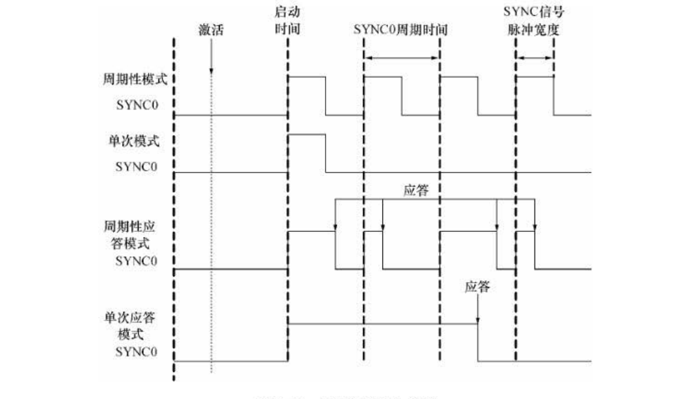

**图 3.25　同步信号产生与 SYNC0/SYNC1 关系**（原书 p.95）

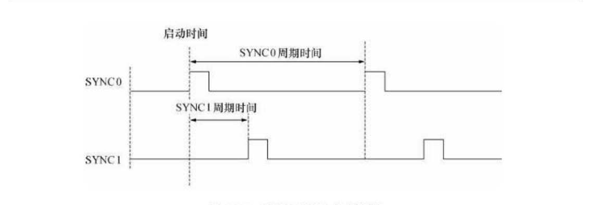

#### 1. 同步信号 SYNC0 / SYNC1

分布时钟控制单元可以产生**两个同步信号 SYNC0 和 SYNC1**，用于给应用层程序提供**中断**或**直接触发输出数据更新**。

| 地址 | 位 | 名称 | 说明 |
| :--- | :--- | :--- | :--- |
| **0x0980** | 0 | SYNC 输出单元控制 | 0 = 从站控制，1 = PDI 控制 |
| | 4 | 锁存输入单元控制 | 0 = 主站控制，1 = PDI 控制 |
| | 5 | 锁存输入单元控制 | 0 = 主站控制，1 = PDI 控制 |
| **0x0981** | 0 | 激活周期运行 | 1 = 激活 SYNC0 |
| | 1 | 激活 SYNC0 | 1 = 产生 SYNC0 脉冲 |
| | 2 | 激活 SYNC1 | 1 = 产生 SYNC1 脉冲 |
| **0x0982~0x0983** | 0~15 | **SYNC 脉冲宽度** | 以 10ns 为单位 |
| 0x0983 | 0 | 应答模式 | 1 = SYNC 信号由读取 SYNC0/SYNC1 状态寄存器消除 |
| **0x098E** | 0 | **SYNC0 状态** | 应答模式时读此寄存器将消除 SYNC0 信号 |
| **0x098F** | 0 | **SYNC1 状态** | 同上 |
| **0x0990~0x0997** | 0~63 | 周期运行开始时间 | **写**：以 ns 为单位设置开始时间；**读**：下一个 SYNC0 脉冲时间 |
| 0x0998~0x099F | 0~63 | SYNC1 时间 | 下一个 SYNC1 脉冲时间 |
| **0x09A0~0x09A3** | 0~31 | **SYNC0 周期时间** | 两个连续 SYNC0 脉冲之间的时间（ns）；**为 0 = 单脉冲模式** |
| **0x09A4~0x09A7** | 0~31 | **SYNC1 周期时间** | SYNC1 脉冲和 SYNC0 脉冲之间的时间（ns） |

**信号特性**：

* 脉宽由 0x0982~0x0983 设定，周期由 0x09A0~0x09A3 设置；
* 同步单元被激活、SYNC0/1 输出被使能后，**同步单元等"开始时间"到达后产生第一个 SYNC0 脉冲**；
* **SYNC 信号刷新频率 100MHz（10ns 刷新周期）**；
* **SYNC 信号与系统时间之间的抖动为 12ns**。

**4 种运行模式**（由脉宽寄存器和 SYNC0 周期时间共同决定）：

| 模式 | 触发条件 | 行为 |
| :--- | :--- | :--- |
| **（1）周期性模式** | 周期时间 > 0，脉宽 > 0 | DC 控制单元在启动操作后产生**等时**同步信号，终止后停止。**脉冲宽度必须大于 0**；如果脉宽 > 周期时间，则 SYNC 信号在启动后总保持有效 |
| **（2）单次模式** | **SYNC0 周期时间 = 0** | 启动时间到达后**只产生一个同步信号脉冲**。重新写入开始时间并重启周期单元后可产生下一个脉冲 |
| **（3）周期性应答模式** | **脉宽 = 0** | 典型应用是**产生等时中断**。SYNC 信号在**获得应答之前保持有效**，由微处理器读 SYNC0/SYNC1 状态寄存器产生应答。第一个脉冲在启动时间到达后产生，之后在下一个 SYNC0/1 事件时产生 |
| **（4）单次应答模式** | 脉宽 = 0 且周期时间 = 0 | 启动时间到达时只产生一个脉冲，**在读到应答之前保持有效**。重写开始时间并重启后可产生下一个 |

**SYNC1 与 SYNC0 的关系**：

* SYNC1 **依赖于 SYNC0**，可以比 SYNC0 **延迟一个预定义的量**，延迟量由 SYNC1 周期时间寄存器（0x09A4~0x09A7）设置；
* **SYNC1 与 SYNC0 并非一一对应**——SYNC1 **总以其后的下一个 SYNC0 信号为参照基准**。

> **同步信号为什么要两种**：SYNC0 和 SYNC1 是给从站应用**两个有固定时间差的触发点**用的。
>
> 典型用法：**SYNC0 触发"采样输入"（锁存当前编码器/AD 值），SYNC1 触发"更新输出"（把算好的值推到 PWM）**。两者的间隔就是留给微处理器**计算控制算法**的时间窗。**先把输入"拍照"定格，再算，最后统一"开枪"输出**——这就是伺服里常说的"采样-计算-输出"三步节拍，用两个 SYNC 就把它精确地钉在了系统时间轴上。

**同步信号的初始化过程**：

1. 设备上电，自动从 EEPROM 装载默认值；PDI 控制寄存器 `0x0140.10 = 1` 使能 DC 同步信号输入单元；配置 `0x0151` 使 SYNC0/1 使用适当的输出驱动模式；设置脉宽寄存器 0x0982~0x0983；
2. 设置寄存器 **0x0980**，**分配同步单元给 ECAT 帧或 PDI 控制**，决定后续参数设置操作由谁执行（**默认由 ECAT 帧执行**）；
3. 设置 SYNC0 和 SYNC1 信号**周期时间**；
4. 设置**周期性运行启动时间**——**启动时间必须是在周期性运行激活时刻之后**，否则必须等计数器溢出后才开始周期性运行；
5. 设置寄存器 **0x0981.0 = 1** 激活周期性运行，并使能 SYNC0/1 输出（设置 `0x0981[2:1] = 0x03`），同步单元在启动时间到达后开始产生 SYNC0 脉冲。

#### 2. 同步锁存信号 Latch

DC 锁存单元可以为**两个外部事件信号**保存时间标记：**Latch0 和 Latch1**。

* **上升沿和下降沿的时间标记都被记录**；
* 有些从站还可以记录**存储同步管理器事件时间标记**；
* **锁存信号采样率 100MHz**，相应**时间标记的内部抖动为 7ns**；
* 锁存信号状态可以从锁存状态寄存器读取；
* DC 锁存单元支持两种模式：**单事件模式**或**连续模式**。

> **Latch 是 EtherCAT 做"精确测量"的利器**。它能回答一个非常具体的问题：**"这个外部信号是在系统时间的哪个纳秒跳变的？"**
>
> 典型应用：
> * **探针/飞拍**：工件经过光电开关的那一瞬间必须记录位置——用 Latch0 记下跳变时刻，主站就能算出精确位置，误差只在纳秒级；
> * **多轴同步采集**：两个从站的 Latch 用同一个系统时间戳，主站就知道"这两件事在时间上差多少"。
>
> 注意 **Latch 的抖动（7ns）比 SYNC 的（12ns）还小**——因为它只做"记录时间"这一件事，路径最短。

---

## 本章小结

| 主题 | 一句话核心 |
| :--- | :--- |
| **ESC 是什么** | 硬件实现 EtherCAT 数据链路层的专用芯片，通信速度与从站微处理器性能**无关** |
| **芯片选型** | ET1100（4 端口 / 8 FMMU / 8 SM / 8KB RAM / 64 位 DC）是标准款；ET1200 是精简款；FPGA 可用 IP-Core 裁剪 |
| **存储空间** | 64KB DPRAM = 4KB 寄存器 + 1~60KB 过程数据区 |
| **缓存区差异** | **寄存器区有缓存**（帧 FCS 对了才生效），**过程数据区没有**（立即生效） |
| **特征信息** | 0x0000~0x0009 是芯片"身份证"：类型、FMMU 数、SM 数、RAM 大小、端口配置 |
| **MII vs EBUS** | MII 约 500ns/端口、可跑 100m；EBUS 约 100ns/端口、限 10m |
| **配置引脚** | **上电时被锁存决定工作模式**，之后复用为普通引脚——接错会导致链路起不来 |
| **端口控制** | 由主站控制，微处理器不碰数据链路；全闭合时**端口 0 自动打开作为恢复端口** |
| **错误计数** | 端口无效帧/接收错误/转发错误/处理单元错误/链接丢失，**到 0xFF 就停，需写操作清除** |
| **站点地址** | 0x0010 配置站点地址（主站配置）；0x0012 站点别名（从 EEPROM 装载，需置 0x0100 位 24） |
| **FMMU 通道** | 从 0x0600 起，每通道 16 字节，**可按位映射**（一个字节装 8 个从站的开关量） |
| **状态机三步** | 主站写 0x0120 → 从站写 0x0130 或报错到 0x0134 → 主站读 0x0130 并写错误应答 0x0120.4 |
| **握手坑** | 有微处理器时，**ECAT 帧写完 AL 控制寄存器后 PDI 必须读一次**；纯 I/O 从站需置 0x0140.8=1 |
| **中断** | PDI 中断（AL 事件 → IRQ）、ECAT 帧中断（AL 事件 → 子报文状态位）、SYNC 中断（**12ns 抖动，可直接接中断引脚**） |
| **看门狗** | 过程数据看门狗超时 → **收回数字量输出**，是设备的安全阀；PDI 看门狗只报告不影响输出 |
| **SM 通道** | 从 0x0800 起，每通道 8 字节，地址长度必须 >1，**操作必须从起始地址开始** |
| **3 缓存区模式** | 用于**周期过程数据**，随时读最新值，旧数据可被覆盖，第二/三缓存区不可被其他 SM 使用 |
| **邮箱模式** | 用于**非周期数据**，单缓存区 + 握手，不丢数据；SM0 主→从、SM1 从→主；**Ctr 计数器做重复检测** |
| **SII** | EEPROM 中的从站信息接口，**主站靠它认设备**；字 0~63 必须，含 ESC 配置区和产品标识 |
| **EEPROM 访问** | 主站与 PDI **争用控制权**，可被强制剥夺；写操作需**同一帧内同时给写使能和写命令** |
| **EEPROM 错误** | **连续两次读取失败**才报设备信息错误并禁止 PDI 运行；无应答错误常因 EEPROM 内部写周期几毫秒，ESC 会自动重试 |
| **SYNC 信号** | SYNC0/1，100MHz 刷新、**12ns 抖动**；4 种模式（周期/单次/周期应答/单次应答）；**SYNC1 总参照其后的下一个 SYNC0** |
| **Latch 信号** | Latch0/1 记录外部事件上升/下降沿的时间戳，**抖动仅 7ns**，用于飞拍与精确测量 |

---

**上一章**：[第2章 EtherCAT 协议](第2章%20EtherCAT协议.md) ｜ **下一章**：[第4章 EtherCAT 硬件设计](第4章%20EtherCAT硬件设计.md)
