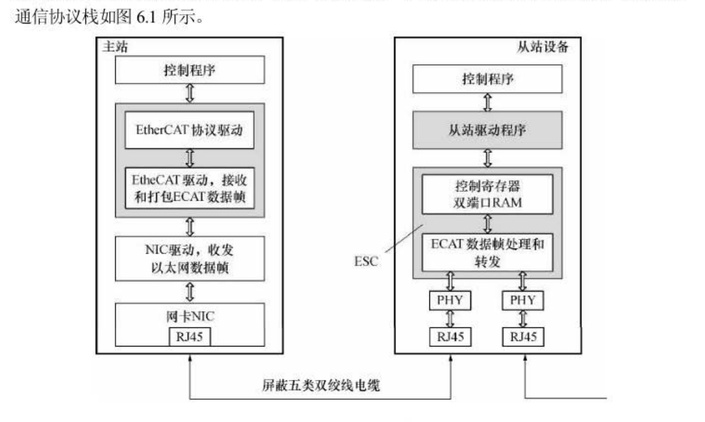
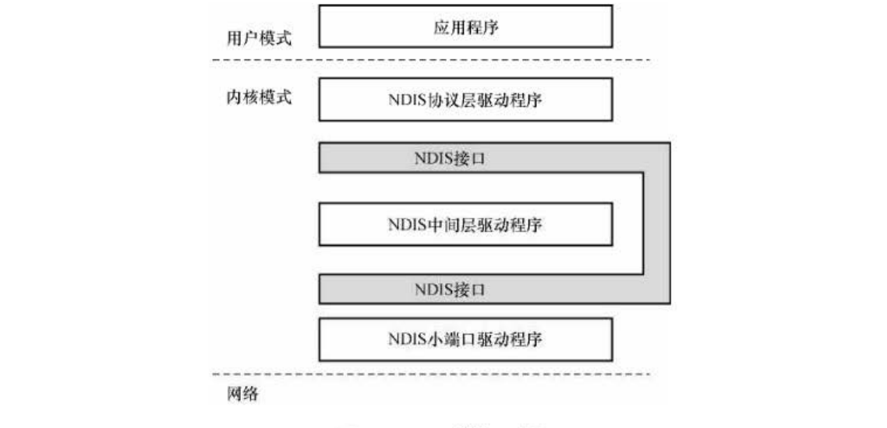
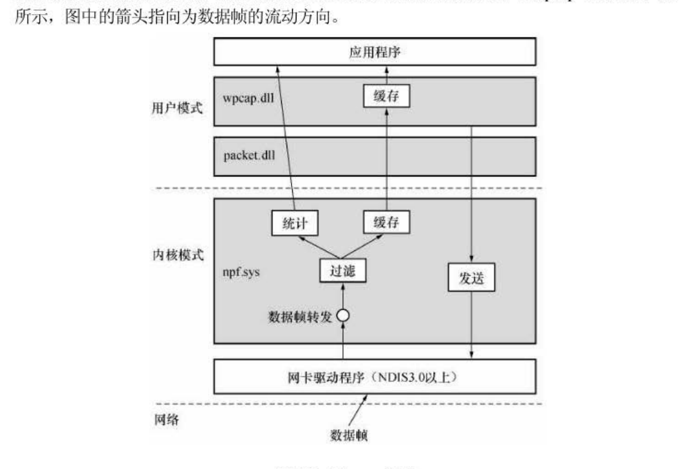
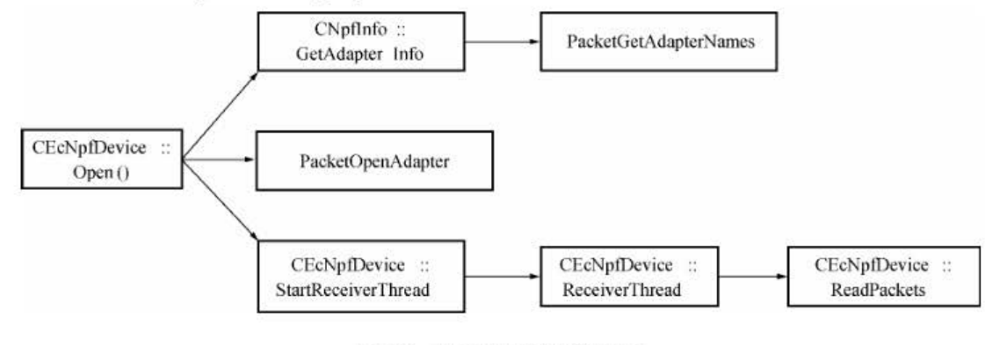
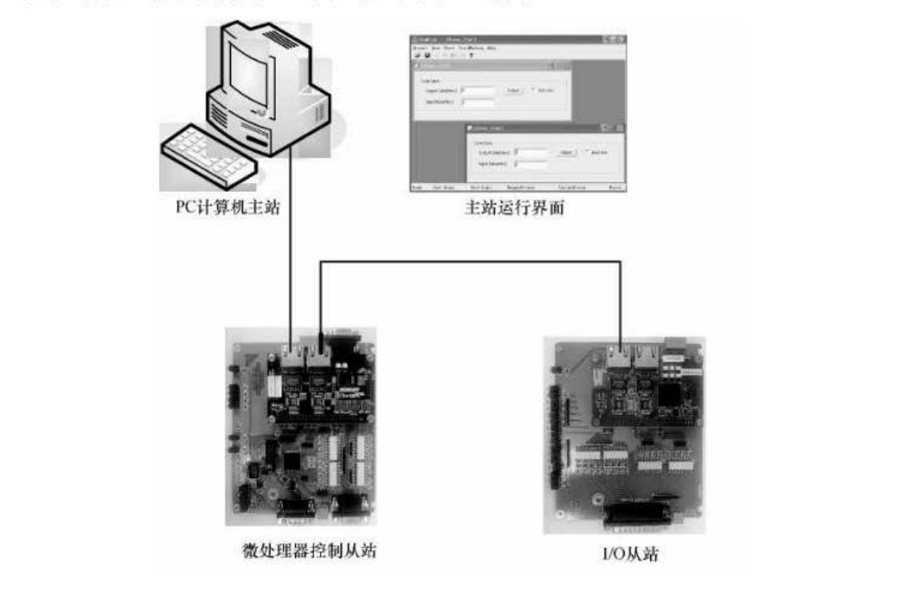
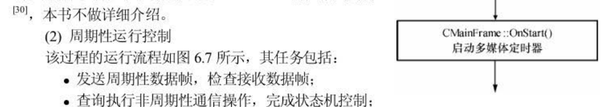
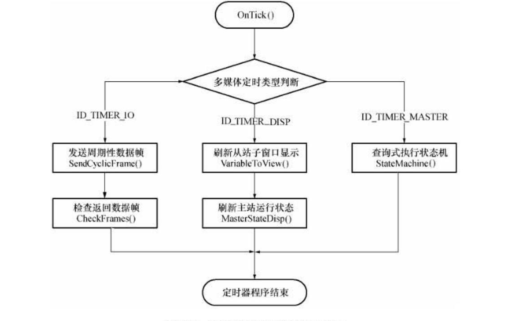
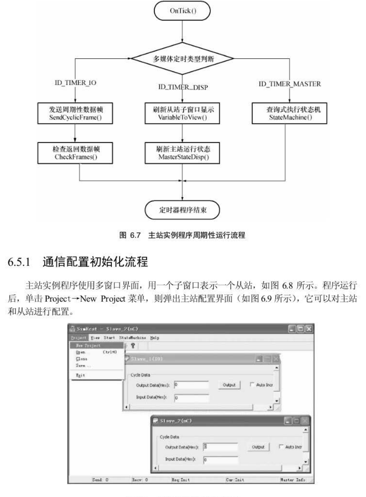
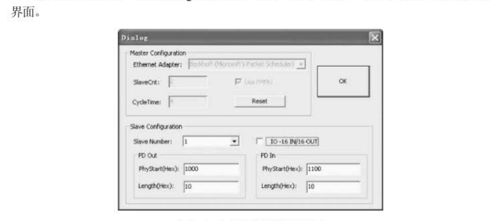

# 第6章 EtherCAT 主站驱动程序

> 本章解决的问题：**主站没有专用芯片，全靠软件——那这个软件到底怎么写？**
>
> 一句话主线：**在普通网卡上"裸发裸收"以太网帧 → 自己拼 EtherCAT 帧 → 用状态机把从站一步步拉起来 → 然后周期性收发过程数据。**

---

## 开篇：主站的软件形态

**图 6.1　EtherCAT 控制系统协议栈**（原书 p.144）



EtherCAT 主站可以由 PC 或其他嵌入式计算机实现。用 PC 时：

* **硬件接口**：标准以太网网卡 **NIC**（Network Interface Card）；
* **功能全部由软件实现**——**主站没有专用芯片**，这是它和从站最大的不同。

整体协议栈：

```
主站                                   从站设备
┌──────────────┐                    ┌──────────────┐
│  控制程序     │                    │  控制程序     │
├──────────────┤                    ├──────────────┤
│ NIC 驱动，收发 │                    │ 从站驱动程序  │
│ 以太网数据帧   │                    ├──────────────┤
├──────────────┤                    │     ESC      │
│    网卡 NIC   │ ←── 五类双绞线 ──→ │   (专用芯片)  │
└──────────────┘                    └──────────────┘
```

**本章介绍的是作者在 Windows XP 下开发的 EtherCAT 主站驱动程序示例**，实现基本的 EtherCAT 数据通信：

* EtherCAT 通信初始化；
* 周期性数据传输；
* 非周期性数据传输。

这些功能由**三个基本类**实现：

| 类 | 职责 |
| :--- | :--- |
| **① `CEcNpfDevice` 和 `CNpfInfo`** | 主站通信**网卡的管理**和以太网数据帧的收发 |
| **② `CEcSimSlave`** | 定义**从站配置数据**，构造一个从站对象 |
| **③ `CEcSimMaster`** | 实现**主站全部功能**：网络初始化、周期性数据收发、非周期性数据收发 |

> **看一下这个类的划分，其实非常"教科书"**：
>
> * `CNpfInfo` / `CEcNpfDevice` —— **"怎么跟网卡说话"**（平台相关，换系统就换掉）
> * `CEcSimSlave` —— **"从站长什么样"**（纯数据描述）
> * `CEcSimMaster` —— **"EtherCAT 协议怎么跑"**（真正的业务逻辑）
>
> **这个分层值得学**：它把"操作系统相关"和"协议相关"彻底分开了。你要把主站移植到 Linux，**只需要重写前两个类，`CEcSimMaster` 一行都不用改**。自己写主站时建议照抄这个切法。

> ⚠️ **时代提醒**：本章代码基于 **Windows XP + MFC + WinPcap**，用 `PacketGetAdapterNames` / `PacketReceivePacket` 这类 API。**这些今天都过时了**，但**思路完全没过时**——你在 Linux 上用 `AF_PACKET` 原始套接字、用 `libpcap`、或用现成的 **SOEM / IgH EtherCAT Master**，逻辑一模一样。**看这一章请盯"流程"和"为什么"，别盯 API 名字。**

---

## 6.1 数据定义头文件

`EthernetService.h` 定义以太网数据帧和 EtherCAT 数据帧相关的**常量、数据结构和运算方法**。

### 关键常量

```c
#define ETHERNET_FRAME_TYPE_IP    0x0800    // IP 数据帧以太类型
#define ETHERNET_FRAME_TYPE_ECAT  0x88A4    // EtherCAT 帧以太类型
#define ETHERNET_MAX_FRAME_LEN    1514      // 以太网数据帧最大长度
```

### MAC 地址结构：`TETHERNET_ADDRESS`

```c
typedef struct TETHERNET_ADDRESS {
    BYTE b[6];
    ...
} TETHERNET_ADDRESS;
```

作者在 C++ 环境下给它**重载了一堆运算符**，让它用起来像普通变量：

| 成员 | 作用 |
| :--- | :--- |
| `operator%(int hashSize)` | 计算哈希值——**用于把 MAC 地址放进哈希表** |
| `operator==` / `operator!=` | 和另一个 MAC 地址比较（内部用 `memcmp`） |
| `operator=` | 用另一个 MAC 地址或字符串赋值 |
| `IsValid()` | 判断是否为有效 MAC 地址 |
| `Clear()` | 清零 MAC 地址 |
| `ld2String()` | 把 MAC 地址转成字符串（如 `00:1A:2B:3C:4D:5E`） |

还定义了几个常用地址：

```c
// 广播地址
// 空 MAC 地址
NullEthernetAddress
BroadcastEthernetAddress
```

> **为什么要重载运算符而不是写函数**：MAC 地址在主站代码里出现在**几十上百个地方**（比较、赋值、打印、做哈希键）。如果不重载，每一处都得写 `memcmp(a.b, b.b, 6)`。**重载之后 `if (addr1 == addr2)` 就完事了，代码可读性完全不同。**
>
> 一个很实用的小细节：**`operator%` 用来算哈希值**——这暗示了"**主站内部很可能用哈希表按 MAC 管理网卡**"。设计数据结构时**先想清楚它会被怎么用**，再决定提供哪些操作，这就是例子。

### 帧结构体

| 结构体 | 内容 |
| :--- | :--- |
| `TETHERNET_FRAME` | 标准以太网帧头（目的地址、源地址、类型） |
| `TETYPE_88A4_HEADER` | EtherCAT 数据头（**后续数据长度 + 保留位 + 类型**） |
| `TETHERNET_88A4_FRAME` | EtherCAT 数据帧 = 以太网头 + 0x88A4 头 + 数据 |
| `TETYPE_EC_HEADER` | **EtherCAT 子报文头**（命令、索引、地址、长度、后续标志等） |
| `TETHERNET_88A4_MAX_HEADER` | EtherCAT 最大数据结构 |
| `TETHERNET_88A4_MAX_FRAME` | EtherCAT 最大数据帧 |

**EtherCAT 数据帧类型定义**（`TETYPE_88A4_HEADER.Type` 的取值）：

| 值 | 含义 |
| :--- | :--- |
| 1 | ECAT header follows（**后面是 EtherCAT 子报文**，最常用） |
| 2 | ADS header follows |
| 3 | I/O |
| 5 | Network Variables |
| 6 | ETHERCAT_CANOPEN_HEADER follows |

> **这个头文件的存在，本身就是一条重要经验**：**把所有"线上的字节布局"集中到一个头文件里**。
>
> 为什么？因为**协议帧结构是会变的**（加字段、扩地址位宽）。如果每个 `.cpp` 里都手写偏移量 `pFrame+14+2+10`，改一次协议你要翻遍整个工程。集中定义了结构体之后，**改一处，处处生效**，而且 `pFrame->Ether.FrameType` 比 `*(WORD*)(buf+12)` 好读一万倍。
>
> **写任何通信程序都应该有这个文件。** 它叫"协议字典"更贴切。

---

## 6.2 网卡操作相关类的定义和实现

### 6.2.1 基于 NDIS 的网卡驱动程序

**图 6.2　NDIS 结构示意图**（原书 p.153）



**图 6.3　WinPcap 组成**（原书 p.153）



作者用 **WinPcap** 的 **NPF（Netgroup Packet Filter）** 驱动来收发原始以太网帧。

**为什么要走这条路**：普通 socket 只能收发 **IP 包**，而 EtherCAT 帧的以太类型是 **0x88A4**，**根本不走 IP 协议栈**——用 socket 发不出去。所以必须绕过 TCP/IP，**直接操作网卡驱动**，在"数据链路层"这一级收发裸帧。

**在 Windows 上这套东西叫 NDIS 中间层驱动**；WinPcap 就提供了这样一个驱动（NPF）+ 一个用户态库（`packet.dll` / `wpcap.dll`）。

> **一句话理解 WinPcap 的角色**：它**在网卡和操作系统协议栈之间开了一扇旁门**，让你能"**看见并发送网卡上原始的一串串 0 和 1**"，而这些帧本来是要被 IP 协议栈吃掉/丢掉的。
>
> **打个比方**：操作系统平时帮你收快递，但它只认"给我家的包裹"（IP 包），别的直接扔了。WinPcap 相当于**让你直接蹲在小区门口**，什么车进来你都能拦下来看一眼。**EtherCAT 帧就是那些"收件人地址写着 0x88A4、邮政系统不认识的包裹"**——只能靠蹲门口解决。
>
> 这也是为什么**主站要独占网卡**：你蹲在门口的时候，"操作系统自己的快递岗"就得停工。所以做 EtherCAT 主站的网卡**必须禁用 TCP/IP 协议栈**（第1章提过）——否则系统自己也在抢这块网卡，两边互相干扰。

### 6.2.2 `CEcNpfDevice` 类

封装**一块网卡的操作**。

**公有成员函数**：

| 函数 | 作用 |
| :--- | :--- |
| `CEcNpfDevice(macAdapter)` / `CEcNpfDevice(pszAdapter)` | 构造：按 **MAC 地址**或**网卡名称**指定要用的网卡 |
| `~CEcNpfDevice()` | 析构 |
| `Release()` | IUnknown 风格释放 |
| **`Open()`** | **打开选定的网卡** |
| **`Close()`** | **关闭网卡** |
| `GetLinkSpeed()` | 获得链接波特率 |
| **`SendPacket(pData, nData)`** | **向网卡发送一个数据包** |
| **`CheckRecvFrame(pData)`** | **从接收缓存区取出一个数据帧**（返回帧长度） |

**保护的成员**：`ReadPackets()`（从网卡读数据包存到 fifo 列表）、`m_pszAdapter`（网卡名称）、`m_macAdapter`（网卡 MAC 地址）

**私有的成员**（**这是"接收线程"的实现**）：

| 成员 | 作用 |
| :--- | :--- |
| `StartReceiverThread(nPriority)` | 创建一个线程，专门收以太网帧（默认优先级 `THREAD_PRIORITY_HIGHEST`） |
| `ReceiverThread(lpParameter)` | 线程函数本体 |
| `m_lRef` / `myAdapter` | 引用计数 / 打开的网卡操作信息 |
| `m_listPacket` | **接收缓存列表（FIFO）** |

> **`StartReceiverThread` 是这一章最该学的一个结构。**
>
> **为什么接收必须用独立线程**：EtherCAT 主站要面对两种截然不同的节奏——
> * **发送**：由主站的周期定时器精确驱动，**几毫秒甚至几百微秒一次**，非常规律；
> * **接收**：从站回帧什么时候来**完全不可预测**（受拓扑、线长、从站处理时间影响）。
>
> 如果接收用"轮询"，会怎样？轮询间隔设短了**白烧 CPU**，设长了**帧被新帧覆盖、丢失数据**。而且轮询和你的控制周期会**互相抖**。
>
> 所以正确做法是：**开一个高优先级线程死等网卡中断**（`WaitForMultipleObjects` + `PacketGetReadEvent`），**收到就丢进 FIFO 队列**；主线程只管在需要的时候从队列里拿。
>
> **这就是经典的"生产者-消费者"模型**：接收线程是生产者，主循环是消费者，**FIFO 队列是缓冲区**。它把"数据什么时候来"和"我什么时候处理"这两件互相冲突的事情**解耦**了。
>
> **写任何实时通信程序都应该用这个结构。** 顺便记一条规则：**FIFO 里的帧不要"取最新丢掉旧的"**——EtherCAT 里每一帧都可能带着不同索引（周期帧 / 状态帧 / 邮箱帧），丢帧会直接导致状态机卡住。

### 6.2.3 `CNpfInfo` 类

封装**获取网卡信息**的操作：

| 函数 | 作用 |
| :--- | :--- |
| `GetAdapterCount()` | 获得当前计算机**网卡数目** |
| `GetAdapterName(nAdapter)` | 按编号获得**网卡名称** |
| `GetAdapterDescription(nAdapter)` | 按编号获得**网卡描述信息** |
| **`GetAdapterInfo()`** | 获得计算机**所有网卡的信息**，保存到数组 `m_pAdapterInfo[MAX_NUM_ADAPTER]` |
| `GetAdapter(macAddress)` / `GetAdapter(pszAdapter, macAddress)` / `GetAdapter(nAdapter, macAddress)` | **按 MAC / 名称 / 编号打开网卡**，得到操作信息 |

### 6.2.4 获得计算机网卡信息

`CNpfInfo::GetAdapterInfo()` 调用 `packet.dll` 里的 **`PacketGetAdapterNames()`** 获得本机所有网卡名称，最终保存在结构体数组 `m_pAdapterInfo` 中。

**注意代码里的一个细节**：

```c
if (PacketGetAdapterNames(szAdapterName, &nAdapterLength) == FALSE) {
    delete[] szAdapterName;
    szAdapterName = new char[nAdapterLength];   // 按函数返回的实际长度重新分配
    if (PacketGetAdapterNames(...) == FALSE) {  // 再试一次
        delete[] szAdapterName;
        return FALSE;
    }
}
```

**含义**：第一次调用时如果缓冲区太小，函数会**告诉你需要多大**，所以**按新长度重新分配再调一次**。

> **这是个很通用的 API 设计套路，叫"两次调用约定"**：调用方先给一个小缓冲区试探，API 返回 FALSE 并把所需大小写到长度参数里，调用方再按正确大小分配重调。
>
> 你以后**自己设计 API 时也可以这么干**（Windows 的 `GetWindowText`、`RegQueryValueEx` 等都是这风格）。**好处**是调用方不必预先猜大小。**代价**是调用方要写两遍调用，容易忘——所以很多现代 API 改成"先调一次查询大小"的独立函数。

### 6.2.5 打开网卡

`ReadPackets()` 里能看到打开一块网卡要设置的所有东西（**这段值得细看，因为它是"让网卡进入 EtherCAT 工作状态"的完整清单**）：

| 设置 | 作用 |
| :--- | :--- |
| **混杂模式**（promiscuous mode） | 让网卡**接收所有经过它的帧**，而不只是发给本机的 |
| **`PacketSetMinToCopy(adapter, 1)`** | 设置内核缓冲区中**激发事件的最小数据长度**（设为 1 = 只要有一个字节就来通知我） |
| **`PacketSetBuff(adapter, 512000)`** | 设置**内核接收缓冲区为 512KB** |
| **`PacketSetReadTimeout(adapter, INFINITE)`** | 设置读操作的超时（**INFINITE** = 一直等） |
| **`PacketAllocatePacket()` + `PacketInitPacket()`** | 分配并初始化**接收数据区结构** |

然后进入接收循环：

```c
hEvents[0] = m_hCloseEvent;                       // 关闭网卡事件
hEvents[1] = PacketGetReadEvent(m_pAdapter);      // 读数据包事件
while (!m_bStopReceiver) {
    switch (::WaitForMultipleObjects(2, hEvents, FALSE, INFINITE)) {
    case WAIT_OBJECT_0:      break;               // 关闭网卡 → 退出
    case WAIT_OBJECT_0 + 1:                       // 有数据包来了
        if (!PacketReceivePacket(myAdapter, pPacket, TRUE)) break;
        if (m_bStopReceiver) break;
        // 把收到的每个帧从内核缓冲区搬到 FIFO 列表
        ...
    }
}
```

**搬数据的细节**：内核缓冲区里的数据**可能是多个帧连续排列的**，所以要从头开始遍历，**每个帧有一个 `bpf_hdr` 头**，按 `bh_hdrlen + bh_caplen` 的长度往后跳，**并且要按 `PACKET_WORDALIGN` 字对齐**。每帧新建一份拷贝（`new BYTE[sizeof(bpf_hdr) + bh_caplen]`），加入 `m_listPacket`。

> **这里三个点都是"实战经验"，值得抄下来**：
>
> **① `WaitForMultipleObjects` 同时等两个事件**：这是"**优雅退出**"的标准写法。线程阻塞在一个"永远等不到"的等待上时，你怎么让它退出？`TerminateThread` 强杀很危险（可能正好锁着资源）。**正确做法是再加一个"关闭"事件**——主线程要退出时 `SetEvent(m_hCloseEvent)`，接收线程立刻醒来看到 `WAIT_OBJECT_0` 就自己收拾干净退出。
>
> **② 必须遍历整个内核缓冲区，不能假设"一次一个帧"**：高性能驱动为了效率会**攒一批**再唤醒你。如果你每次只处理第一个帧，**后面的帧就被永久丢弃了**——这种 bug 在低速测试时完全看不出来，一上高速就丢数据。
>
> **③ 字对齐不能省**：`PACKET_WORDALIGN` 的原因是在某些架构上，**非对齐访问会直接崩或者奇慢**。网络缓冲区格式（BPF）就是这么定义的，**必须照做**。

### 6.2.6 发送数据帧

`SendPacket(pData, nData)` —— 把准备好的帧交给网卡发出去。

### 6.2.7 接收数据帧

**图 6.4　接收数据帧流程调用图**（原书 p.160）



`CheckRecvFrame(pData)` —— **应用程序调用它从 `m_listPacket` 取出一个数据帧**：

```c
long CEcNpfDevice::CheckRecvFrame(PBYTE pData) {
    PVOID pTemp;
    if (m_listPacket.Remove(pTemp)) {           // 从 FIFO 取出一个
        struct bpf_hdr* pHdr = (struct bpf_hdr*)pTemp;
        int nData = pHdr->bh_caplen;
        memcpy(pData, ((BYTE*)pHdr + sizeof(bpf_hdr)), nData);  // 剥掉 bpf 头
        delete pTemp;
        return nData;                            // 返回帧长度
    }
    return 0;   // 队列空，返回 0
}
```

> **注意 `return 0` 表示"没数据"这个约定**：调用方必须判断返回值，**不能假设调用一次就一定有帧**。
>
> 一个常见的新手 bug：主循环里"发完一帧就立刻 `CheckRecvFrame`"，然后**不判断返回值就去解析**——结果从站还没回，解析到一堆垃圾，状态机乱跳。**正确做法是"没数据就跳过，下一轮再看"**：实时系统里"等"是反模式，**"下一轮再说"才是对的**。

### 6.2.8 关闭网卡

退出主站程序前：

1. **先终止接收线程**；
2. 关闭网卡；
3. **清空接收列表变量 `m_listPacket`**。

**顺序不能反**：先停线程再关网卡——反过来会出现"线程还在用已经关掉的网卡句柄"，轻则报错，重则**崩溃**。

---

## 6.3 从站设备对象的定义和实现

### 6.3.1 `CEcSimSlave` 类的定义

```c
class CEcSimSlave {
public:
    CEcSimSlave(int slvType);   // 构造函数，slvType 决定从站类型
    ~CEcSimSlave();
    // 成员：
    //   FMMU[]        FMMU 配置
    //   SYNCMANAGER[] SM 通道配置
    //   m_cStatus     状态字
    //   m_nStatusCode 状态码
    //   m_nD1Addr     数据链路层地址
    //   m_nSlvType    从站类型
    //   m_nOutOffset  从站输出数据存储偏移地址
    //   m_lOut        从站输出数据长度
    //   m_nInOffset   从站输入数据存储偏移地址
    //   m_nInLen      从站输入数据长度
};
```

**这个类的实质是一个"从站描述表"**：FMMU 配置 + SM 配置 + 地址 + 数据长度。**它不干活，只描述"这个从站长什么样"。**

### 6.3.2 `CEcSimSlave` 类的实现

`CEcSimSlave` 类**只实现了构造函数**——对两种类型的从站做配置数据初始化。**每个从站对象在定义时就按默认值初始化，应用程序可以修改微处理器接口从站的周期性数据通信 SM 通道配置。**

**两种从站类型的 SM 默认配置**：

| SM 通道 | 类型 1：8 位并行微处理器总线接口从站 | 类型 0：直接 I/O（16 位输入 + 16 位输出从站） |
| :--- | :--- | :--- |
| **SM0** | 邮箱输出（数字量输出数据）<br>物理起始地址 **0x1800**，长度 **64 字节**<br>1 个缓存区、写操作、控制字 0x26 | 数字量输出数据<br>物理起始地址 **0x0F00**，长度 **2 字节**<br>1 个缓存区、写操作、控制字 0x46（**CS=0，即不激活**） |
| **SM1** | 邮箱输入（数字量输入数据）<br>物理起始地址 **0x1C00**，长度 **32 字节**<br>1 个缓存区、读操作、控制字 0x22 | 数字量输入数据<br>物理起始地址 **0x1000**，长度 **2 字节**<br>控制字 0x00（**不激活**） |
| **SM2** | **过程数据输出**<br>物理起始地址 **0x1000**，长度 **64 字节**<br>**3 个缓存区**、写操作、控制字 0x24 | **不使用**（地址 0、长度 0） |
| **SM3** | **过程数据输入**<br>物理起始地址 **0x1100**，长度 **16 字节**<br>**3 个缓存区**、读操作、控制字 0x20 | **不使用**（地址 0、长度 0） |

每个从站对象的构造函数里还初始化了：

```c
m_cStatus     = 1;      // 初始状态 = Init
m_nStatusCode = 0;
m_nD1Addr     = 1000;   // 数据链路层地址初值
m_nSlvType    = slvType;
m_nOutOffset  = 0;  m_lOut = 0;  m_nOutLen = 0;
m_nInOffset   = 0;  m_lIn  = 0;
// 所有 SM 通道：状态 = 0，激活位 = 0x01，PDI 控制 = 0
```

> **看这张表，能读出 EtherCAT 从站最核心的"通道分配惯例"**：
>
> | 通道 | 用途 | 缓存区模式 | 为什么 |
> | :--- | :--- | :--- | :--- |
> | **SM0** | 邮箱**输出**（主站→从站） | **1 个** | 邮箱要**握手、不能丢数据** |
> | **SM1** | 邮箱**输入**（从站→主站） | **1 个** | 同上 |
> | **SM2** | 过程数据**输出**（主站→从站） | **3 个** | 过程数据要**随时读最新值、绝不等待** |
> | **SM3** | 过程数据**输入**（从站→主站） | **3 个** | 同上 |
>
> **这就是第 3.5 节那个"缓存区数量选择"的真实落地**：**邮箱用 1 个缓存区换"不丢数据"，过程数据用 3 个缓存区换"零等待"**。**同一个 ESC，两组通道，两种策略**——需求不同，设计就不同，这是很漂亮的一手。
>
> **顺便注意类型 0（直接 I/O）的从站**：它的 **SM0/SM1 直接拿来做数字量输出输入**（地址 0x0F00 / 0x1000，各 2 字节），**完全不使用 SM2/SM3**。因为它是"通道 0/1 模式"的极简从站——**没有微处理器，也就不需要邮箱通信**，只需要"主站写 2 字节 → 直接驱动 16 个输出引脚"和"读 16 个输入引脚 → 2 字节进帧"。**这就是第 4 章直接 IO 模式从站在主站侧的配置形态。**

---

## 6.4 主站设备对象的定义和实现

### 6.4.1 `CEcSimMaster` 类的定义

**`CEcSimMaster` 是驱动程序的主体类。**

**核心成员变量**：

| 成员 | 含义 |
| :--- | :--- |
| `m_pNpfdev` | `CEcNpfDevice*`，**网卡设备指针** |
| `m_ppEcSlave` | `CEcSimSlave**`，**从站对象指针数组** |
| `m_InputImage[MAXIMAGESIZE]` | **输入数据映射区**（从站 → 主站） |
| `m_OutputImage[MAXIMAGESIZE]` | **输出数据映射区**（主站 → 从站） |
| `m_nInSize` / `m_nOutSize` | 输入 / 输出数据**字节数** |
| `m_nStatus` / `m_nRequire` / `m_nReadStatus` | 当前状态 / 请求状态 / 读到的从站实际状态 |
| `m_bFmmu` | **是否使用 FMMU（逻辑寻址）** |
| `m_nEcSlave` | 从站数目 |
| `m_nCycTime` | 周期时间 |
| `m_nIndex` | EtherCAT 命令索引 |
| `m_lSendFrame` / `m_lRecvFrame` | 发送 / 接收帧计数 |
| `m_macAddr` | 网卡 MAC 地址 |

**核心成员函数**：

| 函数 | 作用 |
| :--- | :--- |
| `Open()` | **启动主站运行，打开网卡通信** |
| `CreatSlave(i, nType, nSt1, nLen1, nSt2, nLen2)` | **新建一个从站数据对象，并写入配置数据** |
| `ImageAssign()` | **根据各个从站的 SM 配置情况自动配置从站 FMMU 参数** |
| `StateMachine()` | **处理 EtherCAT 状态机** |
| `PrepareCyclicFrameFmmu()` | 准备**逻辑寻址**周期性发送数据帧框架 |
| `PrepareCyclicFrame()` | 准备**设置寻址**周期性发送数据帧框架 |
| `SendCyclicFrameFmmu()` | 使用**逻辑寻址**发送周期性数据命令（各从站用 FMMU 映射输入输出数据） |
| `SendCyclicFrame()` | 使用**设置寻址**发送周期性数据命令 |
| `CheckFrames()` | **从 `CEcNpfDevice` 接收并处理返回数据帧** |
| `WriteSM(i)` / `ClearSyncM(state)` | 写 / 清除 SM 配置数据 |
| `WriteFmmu(i)` | 写 FMMU 配置数据 |
| `WriteAIControl(state)` / `ReadAlState()` | 写 AL 控制寄存器 / 读从站当前状态 |
| `WriteDIAddr()` | 为从站配置地址 |
| `ActiveOutput(bOut)` | 激活从站输出 |
| `Delay(i)` | 延时函数 |
| `Release()` | 释放网卡设备 |

> **`m_InputImage` / `m_OutputImage` 这两个数组是理解主站的关键**。
>
> 它们是主站的**"过程映像区"**（Process Image）——**控制器眼里，所有从站的输入输出都被"拉平"成了两个连续的字节数组**。
>
> **怎么理解**：假设你有 3 个从站，每个 4 字节输入。那么在控制器程序里，你**不看从站、不看地址、不看帧**，只操作：
>
> ```c
> m_OutputImage[0..3]  = 从站1 要接收的数据
> m_OutputImage[4..7]  = 从站2 要接收的数据
> m_OutputImage[8..11] = 从站3 要接收的数据
> // 而
> m_InputImage[0..3]   = 从站1 的反馈
> ...
> ```
>
> **然后主站负责把这两个数组"投影"到网络上**（通过 FMMU 逻辑寻址，一帧搞定全部从站；详见 6.4.6）。**下一周期从网络收回来的数据又自动填回 `m_InputImage`。**
>
> **这个抽象极其重要**，因为它把"**分布式**"变成了"**看起来是本地的**"：
> * 控制程序的写法就和"读写自己机器里的变量"一模一样；
> * 加一个从站，只是**数组变长**，控制逻辑不用改；
> * 逻辑寻址模式下 **FMMU 自动完成所有搬运**，不需要你手动 `memcpy`。
>
> **这就是为什么所有主流 PLC 的 EtherCAT 配置都是"先分配变量到过程映像，然后像用全局变量一样用它"。**

### 6.4.2 初始化和启动 `CEcSimMaster` 数据对象

定义 `CEcSimMaster` 对象时运行构造函数：

```c
CEcSimMaster::CEcSimMaster(int n) {   // 参数 n = 从站数目
    m_nEcSlave = n;
    m_nStatus = 10;  m_nRequire = 10;
    m_nIndex = 0;    m_lSendFrame = 0;  m_lRecvFrame = 0;
    m_bFmmu = 1;     m_nEth = 0;

    m_ppEcSlave = new CEcSimSlave*[m_nEcSlave];
    memset(m_ppEcSlave, 0, m_nEcSlave * sizeof(CEcSimSlave*));
    for (i = 0; i < m_nEcSlave; i++) {
        m_ppEcSlave[i] = new CEcSimSlave(IOSLAVE);   // 默认按直接 I/O 从站建
        m_ppEcSlave[i]->m_nD1Addr = 1000 + i;        // 依次分配数据链路层地址
    }
    memset(m_OutputImage, 0, MAXIMAGESIZE);
    memset(m_InputImage, 0, MAXIMAGESIZE);
    m_pNpfdev = NULL;
}
```

**注意 `m_nStatus` / `m_nRequire` 初值都是 10**——这**不是随便取的**，而是**主站自己的状态机状态号**（后面 6.4.4 会看到 21、40、41、42、80 这些值）。

`Open()` 启动主站：

```c
bool CEcSimMaster::Open() {
    m_pNpfdev = new CEcNpfDevice(m_macAddr);   // 按 MAC 地址建网卡对象
    if (m_pNpfdev) {
        if (!SUCCEEDED(hr = m_pNpfdev->Open())) return FALSE;   // 打开网卡通信
    }
    return TRUE;
}
```

**注意这里给每个从站分配的数据链路层地址是 `1000 + i`** —— 这就是第 3 章说的**"设置寻址"的站地址**（与物理位置无关）。为什么从 1000 开始而不从 0 开始？

> **避开低位地址是工程习惯**：从 0 开始的地址容易和默认值/未初始化值混淆（`memset` 完就是 0），**出了问题很难分辨"这是从站 0" 还是 "这个变量没赋值"**。跳到 1000 起步，**一眼就能看出"1000 开头的都是有效站地址"**。
>
> 这种做法到处都有：**TCP 端口不用 0~1023、CANopen 节点 ID 不从 0 开始、数据库主键不从 1 开始**……**给"特殊值"留出不重叠的地址空间，是低成本的可维护性投资。**

### 6.4.3 配置从站设备对象

**核心思想：只要正确配置从站 ESC 的 SM 通道参数，就能实现基本的数据通信。如果使用逻辑寻址，还要根据各从站的过程数据设定逻辑寻址命令和各从站的 FMMU 通道参数。**

#### （1）SM 通道配置：`CreatSlave()`

```c
void CEcSimMaster::CreatSlave(int i, int nType, USHORT nSt1, USHORT nLen1,
                              USHORT nSt2, USHORT nLen2) {
    m_ppEcSlave[i] = new CEcSimSlave(nType);
    m_ppEcSlave[i]->m_pSyncM[2].m_nPhyStart = nSt1;   // 输出 SM 起始地址
    m_ppEcSlave[i]->m_pSyncM[2].m_nLength   = nLen1;  // 输出 SM 长度
    m_ppEcSlave[i]->m_pSyncM[3].m_nPhyStart = nSt2;   // 输入 SM 起始地址
    m_ppEcSlave[i]->m_pSyncM[3].m_nLength   = nLen2;  // 输入 SM 长度
    m_ppEcSlave[i]->m_nD1Addr = 1000 + i;
}
```

**参数说明**：

| 参数 | 含义 |
| :--- | :--- |
| `i` | 从站编号 |
| `nType` | 从站类型 |
| `nSt1` / `nLen1` | **输出数据 SM 起始地址 / 长度** |
| `nSt2` / `nLen2` | **输入数据 SM 起始地址 / 长度** |

#### （2）FMMU 通道配置：`ImageAssign()`

**根据各从站的 SM 配置，自动计算出 FMMU 参数。**

关键逻辑（以第 0 个从站为例）：

```c
// 输出 FMMU 逻辑长度 = 输出 SM 通道长度
m_ppEcSlave[0]->m_nOutLen = m_ppEcSlave[0]->m_pSyncM[2 * type].m_nLength;
// 输入 FMMU 逻辑长度 = 输入 SM 通道长度
m_ppEcSlave[0]->m_nInLen  = m_ppEcSlave[0]->m_pSyncM[2 * type + 1].m_nLength;

// 输出 FMMU 逻辑起始地址 = 0x00001000（所有从站共享同一个逻辑空间起点）
m_ppEcSlave[0]->m_pFmmu[0].m_nLgStart   = 0x00001000;
m_ppEcSlave[0]->m_pFmmu[0].m_nLength    = m_ppEcSlave[0]->m_nOutLen;
m_ppEcSlave[0]->m_pFmmu[0].m_cLgStartBit = 0;    // 逻辑起始位 = 0
m_ppEcSlave[0]->m_pFmmu[0].m_cLgStopBit  = 7;    // 逻辑终止位 = 7（按字节对齐）
// 输出 FMMU 物理起始地址 = 输出 SM 通道起始地址
m_ppEcSlave[0]->m_pFmmu[0].m_nPhyStart  = m_ppEcSlave[0]->m_pSyncM[2*type].m_nPhyStart;
// 输出 FMMU 物理起始位 = 0
...
```

> **这段逻辑理解了，就等于理解了 EtherCAT 主站最"绕"的一步。** 用一张图讲清楚：
>
> ```
> 主站的 m_OutputImage            EtherCAT 逻辑地址空间       各从站的物理存储
> ┌──────────────┐               ┌──────────────┐          ┌────────────────┐
> │ 从站0 输出    │──────────────→│ 0x1000 起     │──FMMU0──→│ 从站0 SM2 区域   │
> │ (4 字节)      │               │              │          │                │
> ├──────────────┤               ├──────────────┤          ├────────────────┤
> │ 从站1 输出    │──────────────→│ 0x1004 起     │──FMMU0──→│ 从站1 SM2 区域   │
> │ (4 字节)      │               │              │          │                │
> └──────────────┘               └──────────────┘          └────────────────┘
> ```
>
> **关键点**：**所有从站的 FMMU 都"挂"在同一段逻辑地址空间上**。从站 0 的 FMMU 映射 `0x1000` 开始 4 字节 → 它自己的 SM2；从站 1 的 FMMU 映射 `0x1004` 开始 4 字节 → 它自己的 SM2。
>
> 于是主站**只发一个子报文**（逻辑地址 `0x1000`、长度 8）、**一次广播**，**每个从站自己从正确的位置取走自己的那几字节**。这就是"一帧搞定全部从站"的实现方式，也是 EtherCAT 效率高的根源。
>
> **`m_cLgStartBit = 0` / `m_cLgStopBit = 7` 是"按字节对齐"的写法**——从第 0 位到第 7 位正好一个字节。**只有需要把几个从站的开关量塞进同一个字节时，才会用到位级别的映射**（第 3 章讲过）。这里用字节对齐，简单可靠。
>
> **一个容易混的点**：`0x1000` 在**逻辑地址空间**里，而 SM2 的 `0x1000` 在**从站内部物理空间**里。**两个 0x1000 完全无关**，一个是"虚拟地址"，一个是"物理地址"，别被数字相同搞糊涂了。

### 6.4.4 状态机运行：`StateMachine()`

**这段代码是本章最值得精读的部分**——它展示了主站如何把从站**从 Init 一步步拉到 Op**。

主站用一个**自己的状态号 `m_nStatus`** 来跟踪进度，每调用一次 `StateMachine()` 就推进一步（**它是一个"一次一步"的状态机，而不是一个 `while` 循环把所有事干完**）。

**关键设计：分阶段推进，每阶段"写命令 → 等响应 → 确认"三步走**

```c
case 20:
    WriteSM(...);           // 配置从站 SM 通道
    Delay(DELAYTIME);       // 延时
    m_nStatus = 21;         // 进入等待确认阶段
    break;
case 21:
    ReadAlState();          // 读从站状态
    m_nStatus = 22;
    break;
case 22:
    WriteFmmu(0);  Delay(DELAYTIME);   // 配置从站 FMMU0
    WriteFmmu(1);  Delay(DELAYTIME);   // 配置从站 FMMU1
    WriteAlControl(4);                 // 请求 Safe-Op 状态
    m_nStatus = 40;                    // 主站进入等待状态
    break;

case 40:
    WriteAlControl(8);      // 请求 Op 状态
    m_nStatus = 41;
    break;
case 41:
    ReadAlState();          // 读从站状态
    m_nStatus = 42;
    break;
case 42:
    // 检查从站是否进入 Safe-Op 状态
    if ((m_nReadStatus & 0x000F) == 4)
        m_nStatus = 40;     // 是的 → 主站继续（请求 Op）
    else
        m_nStatus = 21;     // 不是 → 退回上一状态继续等待
    break;
...
// 检查从站是否进入 Op 状态
if ((m_nReadStatus & 0x000F) == 8)
    m_nStatus = 80;         // 是 → 主站进入 Op 状态
else
    m_nStatus = 41;         // 否 → 退回继续等待

// 如果需要状态下降（m_nRequire < m_nStatus）
else if (m_nRequire < m_nStatus) {
    WriteAlControl(m_nRequire / 10);   // 请求从站进入要求的状态
    m_nStatus = m_nRequire;
}
```

**关键点**：

| 要点 | 说明 |
| :--- | :--- |
| **状态号编码** | `m_nStatus` 是"**阶段 × 10 + 子步骤**"：20/21/22 = 第一阶段的三小步；40/41/42 = 请求 Safe-Op；80 起 = Op 完成。**读起来一目了然** |
| **`0x000F` 掩码** | `m_nReadStatus & 0x000F` 取**低 4 位**，就是 AL 状态寄存器 0x0130 的状态值：1=Init、2=Pre-Op、4=Safe-Op、8=Op |
| **"写 → 读 → 判断 → 重试"** | 每次请求后**必读状态确认**，不满足就**退回上一阶段继续等**（`m_nStatus = 21` / `41`），不是报错了事 |
| **`Delay(DELAYTIME)`** | 每步之间插延时，**给从站留处理时间** |
| **状态下降** | `m_nRequire < m_nStatus` 时直接请求低状态（第2章讲过：**向下可以越级**） |

> **为什么要写成"一次一步"而不是一个"从头干到尾"的循环？**
>
> 因为 **EtherCAT 状态机是"异步 + 需要重试"的协议**：
> * 主站写完请求后，**从站什么时候切过去是不确定的**——要等它执行完（可能要几毫秒）；
> * 主站**不能阻塞等待**（一阻塞，周期通信、界面刷新全停了）；
> * 而且**失败可能反复**（从站还在忙、上一个状态没清干净）。
>
> 所以正确模型是：**主站把"启动流程"拆成很多小步，每次定时器来的时候走一步，走不动就原地等下次**。这就是**"非阻塞状态机"**。
>
> **这是嵌入式/实时编程最重要的模式之一**。对比一下"阻塞写法"：
>
> ```c
> // ❌ 阻塞写法：整个程序卡在这里，界面死掉、周期通信停摆
> WriteSM(); Sleep(10);
> while (ReadAlState() != SAFEOP) Sleep(1);
> WriteAlControl(8); ...
> ```
>
> 这就是为什么**第 6.5.2 节的实例程序用三个不同周期的定时器分别驱动周期通信、状态机、界面刷新**——**状态机是被"周期性点名"推进的**，而不是自己霸占着 CPU 跑。

### 6.4.5 发送非周期性 EtherCAT 数据报文

**初始化阶段**，主站发送**非周期性数据帧**给从站完成配置。需要配置的寄存器及对应函数：

| 配置内容 | 函数 |
| :--- | :--- |
| 从站站地址 | `WriteDIAddr()` |
| SM 通道配置 | `WriteSM(i)` |
| FMMU 配置 | `WriteFmmu(i)` |
| AL 控制（状态机） | `WriteAIControl(state)` |

**发送方式：用 `FPWR` 命令写寄存器。** 以配置 SM 为例：

```c
void CEcSimMaster::WriteSM(int i) {   // i = SM 通道号
    ETHERNET_88A4_MAX_FRAME ethFrame;
    ethFrame.Ether.Destination = BroadcastEthernetAddress;   // 目的 MAC = 广播
    ethFrame.Ether.Source      = m_macAddr;
    ethFrame.Ether.FrameType   = 0x88A4;                     // 以太类型

    ETYPE_EC_HEADER ecHdr;
    ecHdr.cmd  = EC_CMD_TYPE_FPWR;     // 使用 FPWR 命令
    ecHdr.idx  = 0x82;                 // 数据帧索引号
    ecHdr.ado  = 0x800 + i * 8;        // 操作 SM 配置寄存器地址 0x800 + i*8
    ecHdr.len  = 8;                    // 子报文数据区长度 = 8 字节
    ecHdr.next = 1;                    // 有后续子报文
    ecHdr.res  = 0;  ecHdr.irq = 0;

    PBYTE pData = ethFrame.Data;
    for (slvCnt = 0; slvCnt < m_nEcSlave; slvCnt++) {
        if ((m_ppEcSlave[slvCnt]->m_pSyncM[i]).m_nLength != 0) {   // 该 SM 有效的从站才配
            ecHdr.adp = m_ppEcSlave[slvCnt]->m_nD1Addr;   // 写入从站设置地址
            memcpy(pData, &ecHdr, 10);  pData += 10;  frameLen += 10;  // 子报文头
            memcpy(pData, &(m_ppEcSlave[slvCnt]->m_pSyncM[i]), 8);    // 8 字节 SM 配置
            pData += 8;  frameLen += 8;
            pData[0] = 0;  pData[1] = 0;   // 2 字节 WKC 清零
            pData += 2;  frameLen += 2;
            pData -= 13;
            pData[0] = pData[0] | 0x7F;    // 消除最后一个子报文的"后续报文"标志
        }
    }
    ethFrame.E88A4.Length = frameLen;
    ethFrame.E88A4.Type = 1;
    if (m_pNpfdev) m_pNpfdev->SendPacket(&ethFrame, frameLen + 16);
    m_lSendFrame++;
}
```

**这段代码的 4 个技术要点**：

| 要点 | 说明 |
| :--- | :--- |
| **一个帧里塞多个子报文** | 循环给每个从站生成"子报文头 + 8 字节配置 + WKC"，**一个广播帧就配好了所有从站**——不用一个一个发 |
| **`next` 标志与"末帧清标志"** | 每个子报文头里 `next = 1`（后面还有），循环结束后**最后一个子报文要把 `next` 清掉**（代码里用 `| 0x7F` 处理 10 字节头中的相应位）。**这就是第2章说的"M"标志**：从站靠它知道"帧还没完，继续往后处理" |
| **WKC 预置 0** | 子报文的数据区后面 2 字节 WKC 必须清零，从站处理成功后自己加 |
| **索引 `idx = 0x82`** | 非周期帧用**高位索引**（0x82 等）与周期帧（0x00~0x7F）区分。**从站收到后看索引就知道这是什么帧**——这是"一帧多用"的分流技巧 |

> **"一个帧里塞 N 个从站配置"是 EtherCAT 效率设计的又一次体现。**
>
> 对比一下传统做法：如果 32 个从站，一个一个发配置帧就是 32 次往返。EtherCAT 只要**发一帧**，里面 32 个子报文按顺序排好，从站 1 处理第一个、从站 2 处理第二个……**帧绕一圈回来，活全干完了**。
>
> 而且注意：**主站不需要知道从站接在哪**。`ecHdr.adp` 填的是**设置地址**（1000+i），子报文会被每个从站看到，**只有地址匹配的那个才处理**。命令是 `FPWR`（设置寻址 + 写），一次只寻址一个从站，但**一堆子报文拼在一帧里**。

### 6.4.6 发送周期性 EtherCAT 数据帧

**核心原则**：**主站用"写数据命令"实现数据输出，用"读数据命令"实现数据输入。**

主站周期性地发送包含写命令和读命令的数据帧，**帧格式固定**。示例程序的做法是：**先准备好一个周期性数据帧"框架"，然后每个周期只往固定位置填新的输出数据**。

> **"先搭框架，后填数据"这个做法叫"零拷贝/预构帧"优化，是实时通信的必备技巧。**
>
> **为什么重要**：如果在每个周期的中断里从头构造整个帧（填 MAC 头、填 EtherCAT 头、填 N 个子报文头、算长度……），**这些内容每个周期都一样**，纯属浪费时间。而在微秒级周期里，**CPU 时间极其宝贵**。
>
> **正确做法**是：
> * **框架一次构好**（MAC 头、子报文头、地址、长度全部固定）；
> * **每个周期只 `memcpy` 输出数据到那几个固定偏移**，然后 `SendPacket`。
>
> 这就是下面代码里 `SendCyclicFrameFmmu()` 只做两件事——**复制输出数据 + 发送**的原因。

#### （1）使用 FMMU 方式（逻辑寻址）

分别用 **`LWR`**（逻辑写，输出）和 **`LRD`**（逻辑读，输入）命令。`PrepareCyclicFrameFmmu()` 的构造过程：

```c
void CEcSimMaster::PrepareCyclicFrameFmmu(unsigned char* pFrame) {
    // ① 填以太网帧头
    pFrame->Ether.Destination = BroadcastEthernetAddress;   // 广播 MAC
    pFrame->Ether.Source      = m_macAddr;
    pFrame->Ether.FrameType   = ETHERNET_FRAME_TYPE_ECAT;   // 0x88A4
    pFrame->E88A4.Reserved = 0;
    pFrame->E88A4.Type     = ETYPE_88A4_TYPE_ECAT;
    pFrame->E88A4.Length   = ETHERNET_MAX_FRAME_LEN - ETHERNET_88A4_FRAME_LEN;
    memset(pFrame + ETHERNET_88A4_FRAME_LEN, 0x00, ...);    // 数据区全部清零

    // ② 第一个子报文：LWR 命令 —— 写输出数据
    pEcHdr->cmd   = EC_CMD_TYPE_LWR;
    pEcHdr->idx   = 0;
    pEcHdr->laddr = m_ppEcSlave[0]->m_pFmmu[0].m_nLgStart;  // 逻辑起始地址
    pEcHdr->len   = m_nOutSize;                             // 输出数据长度
    pEcHdr->next  = 1;
    ...

    // ③ 第二个子报文：LRD 命令 —— 读输入数据
    pEcHdr->cmd   = EC_CMD_TYPE_LRD;
    pEcHdr->idx   = 0;
    pEcHdr->laddr = m_ppEcSlave[0]->m_pFmmu[1].m_nLgStart;
    pEcHdr->len   = m_nInSize;                              // 输入数据长度
    pEcHdr->next  = 1;
    ...

    // ④ 第三个子报文：BRD 命令 —— 读所有从站的状态寄存器，做实时监测
    pEcHdr->cmd  = EC_CMD_TYPE_BRD;
    pEcHdr->adp  = 0;
    pEcHdr->ado  = 0x120;    // AL 控制寄存器地址
    pEcHdr->len  = 2;
    pEcHdr->next = 0;        // 最后一个子报文
    ...

    pFrame->E88A4.Length = frameLen;   // 实际数据长度
}
```

**所以每个周期发出去的帧是"三合一"**：

| 子报文 | 命令 | 作用 |
| :--- | :--- | :--- |
| 第 1 个 | **LWR**（逻辑写） | 把 `m_OutputImage` 里的输出数据写入各从站（各从站用 FMMU 各取所需） |
| 第 2 个 | **LRD**（逻辑读） | 从各从站读出输入数据 |
| 第 3 个 | **BRD**（广播读 0x0120） | **读所有从站的状态寄存器**，主站据此实时监测所有从站 |

**发送时只做两件事**：

```c
void CEcSimMaster::SendCyclicFrameFmmu(unsigned char* pFrame) {
    pEcHdr->idx = m_nIndex;                       // 更新索引
    pData = ENDOF(ecHdr);                         // 定位到 LWR 的数据区
    memcpy(pData, m_OutputImage, ecHdr->len);     // ★ 只复制输出数据
    if (m_pNpfdev)
        m_pNpfdev->SendPacket(&pFrame, ETHERNET_88A4_FRAME_LEN + pFrame->E88A4.Length);
    m_lSendFrame++;
    m_nIndex++;                                   // 周期性数据帧索引递增
    if (m_nIndex >= 0x80) m_nIndex = 0;           // 索引范围 0 ~ 0x7F
}
```

> **第三个子报文的"BRD 读 0x0120"是一个非常巧妙的设计**，值得单独说：
>
> 状态机需要**不断地知道每个从站现在处于什么状态**（Init / Pre-Op / Safe-Op / Op），还要知道有没有从站掉线、报错。
>
> 你可以**单独发一帧**去读状态——但那要占用额外带宽和时间。**EtherCAT 的解法是：把状态读取塞进周期性数据帧里当"搭车乘客"**。
>
> 用 **BRD**（广播读）命令，一次就能把所有从站的状态**读成一串**（每个从站返回 2 字节）。主站收到后**依次比对**就知道每个从站的状态。**代价几乎为零**（16 个从站也才 32 字节），**收益是主站每周期都在做全网络健康检查**。
>
> **这个思路可以推广**：**任何"需要周期监测的辅助信息"，都应该搭在已有的周期帧上，而不是单独开一条通道。** 这就是为什么工业协议里常见"把诊断位塞进状态字"的做法。
>
> **另外注意 `m_nIndex` 在 0~0x7F 之间循环**：这个索引让从站（或抓包分析工具）能**区分新旧帧、检测丢帧**。每周期递增，绕回 0x80 就归零。**如果主站发现收到的索引不是期望的"上一个 + 1"，就说明中间丢了帧**——这是一个几乎零成本的链路质量指标。

#### （2）使用设置寻址方式

用 **`FPRD` 和 `FPWR`** 命令操作站点的输入和输出。同样是**先构造一个帧框架**，周期性发送时向固定位置更新输出数据。

**两种方式的对比**：

| | FMMU 逻辑寻址 | 设置寻址 |
| :--- | :--- | :--- |
| 命令 | `LWR` / `LRD` | `FPWR` / `FPRD` |
| 子报文数量 | **2 个**（所有从站合在一段逻辑地址里） | **每个从站一组**（可用同一个设置地址配不同偏移） |
| 需要配置 | **必须配 FMMU**（`ImageAssign`） | **不需要 FMMU** |
| 帧大小 | 随从站数**线性增长但很紧凑** | 每个从站一个子报文头（**10 字节开销 × N**） |
| 适用 | **从站多、要省带宽** | **从站少、想简单** |

> **怎么选**：**从站超过两三个就用 FMMU**。因为设置寻址每个从站都要多花 **10 字节子报文头**，20 个从站就是 200 字节的纯开销；而逻辑寻址**所有从站共享一段连续逻辑地址，一个子报文头搞定**。
>
> **但设置寻址有个优势**：**不需要配 FMMU**，省掉了一步配置，**调试时更容易排查**（"这帧是写给谁的我一眼能看出来"）。所以示例程序两种都实现了，**配置界面上有个 `UseFMMU` 开关让用户自己选**——这个设计很实用：**先用简单的跑通，再换高效的**。

### 6.4.7 接收 EtherCAT 数据帧：`CheckFrames()`

```c
// 从 CEcNpfDevice 得到返回帧，按索引区分类型处理
if (pHead->idx < 0x80) {
    // ===== 周期性数据帧 =====
    // 按子报文顺序依次处理
    memcpy(m_InputImage, ENDOF(pHead), m_nInSize);   // 取出输入数据
    e88A4Len = ETYPE_EC_CMD_LEN(pHead);
    if (pHead->next) pHead = NEXT_EcHeader(pHead);   // 有后续子报文就往后走
    else             pHead = NULL;
} else {
    // ===== 非周期性数据帧（用 Index 表示命令操作类型）=====
    if (pHead->idx == 0x80) {
        // 读从站状态命令
        while (pHead) {
            if (e88A4Len < ETYPE_EC_CMD_LEN(pHead)) break;
            if (pHead->cmd == EC_CMD_TYPE_BRD) {
                USHORT* nSt = (USHORT*)ENDOF(pHead);
                m_nReadStatus = *nSt;      // ★ 拿到从站状态
                e88A4Len -= ETYPE_EC_CMD_LEN(pHead);
            }
            ...
        }
    }
}
```

**关键点**：

| 要点 | 说明 |
| :--- | :--- |
| **用 `idx` 分流** | `idx < 0x80` → 周期帧；`idx >= 0x80` → 非周期帧。**一个接收函数处理两种帧** |
| **遍历子报文链** | 靠 `next` 标志和 `NEXT_EcHeader()` 逐个往后走，直到 `next = 0` |
| **`e88A4Len` 递减** | 每处理一个子报文就减去它的长度，`e88A4Len < 长度` 时 `break`——**这是"防越界读"的保护**。收到的帧可能被截断/损坏，**没有这个检查就会读到帧外的内存** |
| **`m_nReadStatus = *nSt`** | 把 BRD 读到从站状态存下来，供状态机（6.4.4）判断用 |

> **接收侧最重要的两件事**：
>
> **① 一定要遍历完整条子报文链**。因为一帧里有 LWR（输出）+ LRD（输入）+ BRD（状态）三个子报文，**你只想拿输入数据，但必须把整个链走完**——跳过中间的子报文就没法正确计算下一个的位置了（每个子报文长度不同）。**这就是"链式结构"的必然要求**。
>
> **② 必须做长度边界检查**。`e88A4Len` 那个递减判断看着啰嗦，但它是**安全底线**：网络数据是**不可信输入**，一个损坏的帧就可能带一个超大 `len` 字段，**没有检查就会读到缓冲区外面去**——轻则读到垃圾数据让设备乱动，重则崩溃。
>
> **写任何解析网络报文的代码，第一件事就是"先检查长度再解析"**，这没有例外。

---

## 6.5 主站实例程序

实例程序包含**通信配置、初始化**和**周期性运行**两个任务。

### 6.5.1 通信配置初始化流程

**图 6.5　主站实例程序硬件配置**（原书 p.194）



**图 6.6　主站实例程序初始化运行流程**（原书 p.194）



**实例程序用多窗口界面，一个子窗口表示一个从站。**

流程：

1. 单击 **Project → New Project** 菜单，弹出**主站配置界面**；
2. 配置**主站区**和**从站区**；
3. 单击 "OK"，新建主站工程，进入主运行界面。

**（1）主站配置区（Master Configuration）**

| 配置项 | 含义 |
| :--- | :--- |
| **Ethernet Adapter** | 网卡选择 |
| **SlaveCnt** | 从站数目 |
| **CycleTime** | 通信周期 |
| **UseFMMU** | 周期性通信使用 **FMMU 寻址**还是**设置寻址** |

**（2）从站配置区（Slave Configuration）**

* **微处理器接口的从站**：配置其周期性通信所使用的 SM 通道参数（**邮箱通信的 SM 在程序中默认配置**，见 6.3.2 的表 6.1）；
* **I/O 从站**：周期性通信 SM 配置固定，**而且不支持邮箱通信**，所以在配置界面直接给出正确配置（选择 **10-16 IN / 16 OUT**）。

**初始化代码**：

```c
void CMainFrame::OnFileNewproject() {
    int i;
    if (dlg.DoModal() == IDOK) {          // 弹出配置界面，点 OK
        // ① 新建主站类对象
        m_pEcMaster = new CEcSimMaster(dlg.m_nSlvCnt);
        // ② 从界面读配置
        m_pEcMaster->m_nCycTime = dlg.m_nCycleTime;   // 通信周期
        m_pEcMaster->m_macAddr  = dlg.macAddr;        // 网卡 MAC 地址
        m_pEcMaster->m_bFmmu    = dlg.m_bFmmu;        // 是否用 FMMU
        m_pEcMaster->m_nEth     = dlg.ethNum;         // 网卡编号
        // ③ 逐个配置从站
        for (i = 0; i < m_pEcMaster->m_nEcSlave; i++) {
            if (dlg.m_ppSmConfig[i]->m_nSlvType == ISASLAVEFRM) {
                // 微处理器控制型从站 → 重新配置 SM 参数
                m_pEcMaster->CreatSlave(i, ISASLAVEFRM,
                        dlg.m_ppSmConfig[i]->m_nPhyStart1, dlg.m_ppSmConfig[i]->m_nLength1,
                        dlg.m_ppSmConfig[i]->m_nPhyStart2, dlg.m_ppSmConfig[i]->m_nLength2);
            }
        }
        // ④ 准备周期性数据帧框架
        if (m_pEcMaster->m_bFmmu == 1) {
            m_pEcMaster->ImageAssign();              // 配 FMMU
            m_pEcMaster->PrepareCyclicFrameFmmu();   // 逻辑寻址帧框架
        } else {
            m_pEcMaster->PrepareCyclicFrame();       // 设置寻址帧框架
        }
        // ⑤ 启动主站
        if (!(m_pEcMaster->Open())) {
            MessageBox("Open Device Error!");
            return;
        }
        // ⑥ 按从站数目新建子窗口，设置标题（Slave_1 (10) / Slave_2 (uC) ...）
        for (i = 0; i < m_pEcMaster->m_nEcSlave; i++)
            SendMessage(WM_COMMAND, ID_FILE_NEW);
        ...
        m_bTimerStarted = FALSE;
    }
}
```

**初始化的六个步骤**：

| 步骤 | 做什么 |
| :--- | :--- |
| ① | **建主站对象**（顺带按从站数建从站对象数组） |
| ② | **从界面读通信参数**（周期、网卡、寻址方式） |
| ③ | **逐个覆盖从站 SM 配置**（微处理器型从站按用户设置） |
| ④ | **准备周期帧框架**（FMMU 方式要先 `ImageAssign`） |
| ⑤ | **打开网卡启动主站** |
| ⑥ | **建从站子窗口**（界面显示） |

> **注意这个顺序里藏着一个关键依赖**：**④ 必须在 ⑤ 之前**。
>
> 因为 `PrepareCyclicFrameFmmu()` 要读 `m_ppEcSlave[0]->m_pFmmu[0].m_nLgStart` 这类 FMMU 参数来填子报文头——**而这些参数是 `ImageAssign()` 算出来的**。**顺序反了，帧里的逻辑地址就是 0**，主站发的帧从站一个都不认，现象是"通信完全没反应，但也没报错"——**这种 bug 特别难查，因为什么都不报，就是不动**。
>
> 所以初始化的正确顺序是：**先算配置（从站参数 → FMMU）→ 再搭帧 → 最后开网卡**。
>
> **另外注意这里用 `WM_COMMAND / ID_FILE_NEW` 给每个从站建子窗口**——这是 MFC 多文档界面的做法，**每加一个从站，界面上就多一个窗口显示它的数据**。做调试工具时这个设计很贴心：**一眼看到每个从站的实时输入输出。**

### 6.5.2 周期性运行控制

**图 6.7　主站实例程序周期性运行流程**（原书 p.195）



**图 6.8　主站实例程序的运行界面**（原书 p.195）



**图 6.9　主站实例程序配置界面**（原书 p.196）



**实例程序使用多媒体定时器完成周期性数据通信和轮询非周期性任务**（状态机处理、界面刷新等）。

**三个定时器，不同优先级和周期**：

| 定时器标识 | 用途 | 优先级 | 周期 |
| :--- | :--- | :--- | :--- |
| **`ID_TIMER_IO`** | **周期性数据通信** | **最高** | 前面配置的**通信周期时间** |
| **`ID_TIMER_MASTER`** | **非周期任务查询**（状态机等） | 较低 | **50 ms** |
| **`ID_TIMER_DISP`** | **刷新界面显示** | 最低 | **100 ms** |

**回调函数**：

```c
void CMainFrame::OnTick(UINT nId, CTimer* pTimer) {
    switch (nId) {
    case ID_TIMER_MASTER:                       // ===== 非周期性数据通信控制 =====
        if (m_pEcMaster)
            m_pEcMaster->StateMachine();        // 执行状态机函数（见 6.4.4）
        break;

    case ID_TIMER_IO:                           // ===== 周期性数据通信控制 =====
        if (m_pEcMaster->m_nStatus >= 40) {     // 状态到位后才开始周期通信
            if (m_pEcMaster->m_bFmmu == 1)
                m_pEcMaster->SendCyclicFrameFmmu();   // 逻辑寻址发送
            else
                m_pEcMaster->SendCyclicFrame();       // 设置寻址发送
            m_pEcMaster->CheckFrames();         // 检查返回数据帧（见 6.4.7）
            VariableToView();                   // 刷新从站子窗口数据
            MasterStateDisp();                  // 刷新主站运行状态
        }
        break;

    case ID_TIMER_DISP:
        ...
        break;
    }
}
```

> **三个定时器、三个周期，这个分工是本章最值得抄下来的架构。**
>
> **为什么不能用一个定时器全干**：
>
> | 任务 | 时间要求 | 如果和周期通信放一起会怎样 |
> | :--- | :--- | :--- |
> | **周期数据收发** | **必须准时**（微秒级抖动要求） | —— |
> | **状态机推进** | 慢一点没关系（毫秒级够用） | **状态机里的 `Delay`、读状态、重试会拖慢周期通信，导致周期抖动** |
> | **界面刷新** | **更慢也无所谓**（人眼看不出 10ms 和 100ms 的区别） | **画窗口、刷文本很耗时（毫秒级！），放在高优先级周期里会直接毁掉实时性** |
>
> **所以正确做法是按"时间要求"分层：**
> * **最高优先级 + 最短周期**：只放**最必要**的事（发帧、收帧、填数据）；
> * **中优先级 + 50ms**：放"**要定期推进但不需要很准**"的事（状态机、邮箱通信）；
> * **最低优先级 + 100ms**：放"**给人看的**"事（界面）。
>
> **这个"快任务里绝不放慢操作"的原则，是所有实时系统的铁律。** 你在 `ID_TIMER_IO` 里加一句 `printf` 或者一次窗口刷新，周期就可能从 1ms 变成 3ms——**而且是在特定条件下才出现，极难复现**。
>
> **另外注意那个门槛 `m_nStatus >= 40`**：**只有状态机推进到一定程度（从站进入 Safe-Op 之后）才开始发周期数据帧**。在此之前发周期帧毫无意义（从站还没配好，收不到有效数据），而且**可能触发从站的配置检查错误**（第 3 章 AL 状态码 0x0017「无效 SM 通道配置」就是这么来的）。**"该等的时候要等"**，这是状态机存在的意义。

---

## 本章小结

| 主题 | 一句话核心 |
| :--- | :--- |
| **主站没有专用芯片** | 硬件只是普通网卡，**功能全在软件**；从站才有 ESC |
| **三个基本类** | `CEcNpfDevice`/`CNpfInfo`（网卡，平台相关）、`CEcSimSlave`（从站描述）、`CEcSimMaster`（协议逻辑） |
| **分层价值** | 移植到别的系统**只需重写网卡类**，协议类不用动 |
| **为什么不能用 socket** | EtherCAT 帧以太类型 0x88A4 **不走 IP 协议栈**，必须绕过 TCP/IP 直接操作网卡驱动（NDIS / WinPcap / Linux AF_PACKET） |
| **网卡要独占** | 主站网卡必须**禁用 TCP/IP 协议栈**，否则和系统抢网卡 |
| **接收必须用独立线程** | 高优先级线程 + `WaitForMultipleObjects` 死等 → 帧进 **FIFO**，主循环按需取（生产者-消费者） |
| **优雅退出** | 用"关闭事件"通知接收线程退出，**不要强杀线程** |
| **接收缓冲区处理** | 必须**遍历整批帧**、按 `PACKET_WORDALIGN` 对齐，**否则高速时丢数据** |
| **两次调用约定** | `PacketGetAdapterNames` 第一次返回所需长度，第二次才成功 |
| **过程映像区** | `m_InputImage` / `m_OutputImage` 把"分布式的从站"变成"本地数组"，控制程序像用全局变量一样用它 |
| **通道分配惯例** | **SM0/SM1 = 邮箱（1 个缓存区，不丢数据）**；**SM2/SM3 = 过程数据（3 个缓存区，零等待）** |
| **直接 I/O 从站** | 用 SM0/SM1 直接做数字量输出输入（0x0F00 / 0x1000，各 2 字节），**不用 SM2/SM3、不支持邮箱** |
| **站地址分配** | 从 **1000 + i** 起，避开低位地址以便区分"有效地址"和"未初始化" |
| **非阻塞状态机** | 主站状态机拆成"一次一步"，`m_nStatus` 用"阶段×10+子步骤"编码，**走不动就退回等待，绝不阻塞** |
| **状态判断** | `m_nReadStatus & 0x000F` 取低 4 位 = AL 状态（1/2/4/8） |
| **非周期配置帧** | 用 `FPWR` 写寄存器，**一帧塞多个子报文**，`next` 标志串联，**最后一个要清标志** |
| **周期帧"三合一"** | LWR（写输出）+ LRD（读输入）+ **BRD 读状态**（搭车做全网络健康检查） |
| **周期帧优化** | **框架一次构好，每周期只 `memcpy` 输出数据**（预构帧，省 CPU） |
| **索引分流** | `idx < 0x80` = 周期帧，`idx >= 0x80` = 非周期帧；索引循环还能**检测丢帧** |
| **FMMU vs 设置寻址** | FMMU **省带宽但需配置**；设置寻址**简单但每从站多 10 字节开销** |
| **接收要边界检查** | 必须递减剩余长度并检查，**网络数据是不可信输入** |
| **初始化顺序** | **① 从站参数 → ② ImageAssign 算 FMMU → ③ 搭帧框架 → ④ 开网卡**；顺序错会"没反应也不报错" |
| **三个定时器分层** | **周期通信（最高/最短）+ 状态机（50ms）+ 界面刷新（100ms）**；**快任务里绝不放慢操作** |
| **开跑的门槛** | `m_nStatus >= 40`（进入 Safe-Op 后）才开始发周期帧，**该等就等** |

---

**上一章**：[第5章 EtherCAT 伺服驱动器控制应用协议](第5章%20EtherCAT伺服驱动器控制应用协议.md) ｜ **下一章**：[第7章 从站驱动程序](第7章%20从站驱动程序.md)
