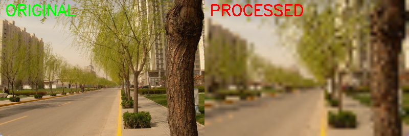

|参数|作用|影响|调整时机|
|-----|----|----|----|
|曝光 Exposure|控制进光时间|图像明暗|光线变化时|
|增益 Gain|放大信号强度|亮度+噪点|曝光不够时|
|白平衡 White Balance|校正色温|色彩准确性|颜色偏色时|
|对比度 Contrast|调整明暗差异|图像层次感|图像发灰时|
|饱和度 Saturation|调整颜色鲜艳度|色彩丰富度|图像单调时|
|锐度 Sharpness|增强边缘清晰度|细节表现力|图像模糊时|
|帧率 Frame Rate|每秒采集图像数量|动态捕捉能力|运动场景时|
|分辨率 Resolution|图像像素大小|图像清晰度|需要细节时|
|焦距 Focal Length|调整视野范围|视野宽窄|需要特写或广角时|


# 一、所有可用的摄像头参数

```py
import cv2

class AdvancedCameraController:
    def __init__(self, camera_index=0):
        self.camera = cv2.VideoCapture(camera_index)
        
    def set_all_parameters(self):
        """设置各种摄像头参数"""
        
        # ===== 基础参数 =====
        self.camera.set(cv2.CAP_PROP_FRAME_WIDTH, 1920)      # 宽度
        self.camera.set(cv2.CAP_PROP_FRAME_HEIGHT, 1080)     # 高度
        self.camera.set(cv2.CAP_PROP_FPS, 30)                # 帧率
        
        # ===== 图像质量参数 =====
        self.camera.set(cv2.CAP_PROP_BRIGHTNESS, 128)        # 亮度 (0-255)
        self.camera.set(cv2.CAP_PROP_CONTRAST, 128)          # 对比度 (0-255)
        self.camera.set(cv2.CAP_PROP_SATURATION, 128)        # 饱和度 (0-255)
        self.camera.set(cv2.CAP_PROP_HUE, 0)                 # 色调
        self.camera.set(cv2.CAP_PROP_GAIN, 0)                # 增益
        self.camera.set(cv2.CAP_PROP_EXPOSURE, -5)           # 曝光 (负值=自动)
        
        # ===== 聚焦参数 =====
        self.camera.set(cv2.CAP_PROP_AUTOFOCUS, 1)           # 自动聚焦 (0=关闭, 1=开启)
        self.camera.set(cv2.CAP_PROP_FOCUS, 50)              # 手动聚焦 (0-255，需关闭自动聚焦)
        
        # ===== 白平衡 =====
        self.camera.set(cv2.CAP_PROP_AUTO_WB, 1)             # 自动白平衡 (0=关闭, 1=开启)
        self.camera.set(cv2.CAP_PROP_WB_TEMPERATURE, 4000)   # 色温 (K)
        
        # ===== 其他参数 =====
        self.camera.set(cv2.CAP_PROP_ZOOM, 100)              # 缩放
        self.camera.set(cv2.CAP_PROP_SHARPNESS, 128)         # 锐度
        self.camera.set(cv2.CAP_PROP_GAMMA, 100)             # 伽马值
        self.camera.set(cv2.CAP_PROP_BACKLIGHT, 0)           # 背光补偿
        self.camera.set(cv2.CAP_PROP_AUTO_EXPOSURE, 1)       # 自动曝光 (0.25=手动, 0.75=自动)
        self.camera.set(cv2.CAP_PROP_BUFFERSIZE, 1)          # 缓冲区大小
        
    def get_all_parameters(self):
        """获取当前所有参数值"""
        params = {
            'Width': cv2.CAP_PROP_FRAME_WIDTH,
            'Height': cv2.CAP_PROP_FRAME_HEIGHT,
            'FPS': cv2.CAP_PROP_FPS,
            'Brightness': cv2.CAP_PROP_BRIGHTNESS,
            'Contrast': cv2.CAP_PROP_CONTRAST,
            'Saturation': cv2.CAP_PROP_SATURATION,
            'Hue': cv2.CAP_PROP_HUE,
            'Gain': cv2.CAP_PROP_GAIN,
            'Exposure': cv2.CAP_PROP_EXPOSURE,
            'AutoFocus': cv2.CAP_PROP_AUTOFOCUS,
            'Focus': cv2.CAP_PROP_FOCUS,
            'Auto White Balance': cv2.CAP_PROP_AUTO_WB,
            'White Balance Temp': cv2.CAP_PROP_WB_TEMPERATURE,
            'Zoom': cv2.CAP_PROP_ZOOM,
            'Sharpness': cv2.CAP_PROP_SHARPNESS,
            'Gamma': cv2.CAP_PROP_GAMMA,
            'Backlight': cv2.CAP_PROP_BACKLIGHT,
            'Auto Exposure': cv2.CAP_PROP_AUTO_EXPOSURE,
        }
        
        print("\n当前摄像头参数：")
        print("=" * 50)
        for name, prop in params.items():
            value = self.camera.get(prop)
            print(f"{name:<25}: {value}")
        print("=" * 50)

# 使用示例
cam = AdvancedCameraController(0)
cam.get_all_parameters()
```

# 二、OPENCV摄像头属性列表

```py
# 所有cv2.CAP_PROP_* 常量

cv2.CAP_PROP_POS_MSEC          # 视频文件的当前位置（毫秒）
cv2.CAP_PROP_POS_FRAMES        # 当前帧的索引（从0开始）
cv2.CAP_PROP_POS_AVI_RATIO     # 视频文件的相对位置（0=开始，1=结束）
cv2.CAP_PROP_FRAME_WIDTH       # 帧宽度
cv2.CAP_PROP_FRAME_HEIGHT      # 帧高度
cv2.CAP_PROP_FPS               # 帧率
cv2.CAP_PROP_FOURCC            # 编码格式
cv2.CAP_PROP_FRAME_COUNT       # 视频文件的总帧数
cv2.CAP_PROP_FORMAT            # 图像格式
cv2.CAP_PROP_MODE              # 捕获模式
cv2.CAP_PROP_BRIGHTNESS        # 亮度
cv2.CAP_PROP_CONTRAST          # 对比度
cv2.CAP_PROP_SATURATION        # 饱和度
cv2.CAP_PROP_HUE               # 色调
cv2.CAP_PROP_GAIN              # 增益
cv2.CAP_PROP_EXPOSURE          # 曝光
cv2.CAP_PROP_CONVERT_RGB       # 是否转换为RGB
cv2.CAP_PROP_WHITE_BALANCE_U   # 白平衡U
cv2.CAP_PROP_WHITE_BALANCE_V   # 白平衡V
cv2.CAP_PROP_RECTIFICATION     # 立体摄像头的校正标志
cv2.CAP_PROP_MONOCHROME        # 单色模式
cv2.CAP_PROP_SHARPNESS         # 锐度
cv2.CAP_PROP_AUTO_EXPOSURE     # 自动曝光
cv2.CAP_PROP_GAMMA             # 伽马值
cv2.CAP_PROP_TEMPERATURE       # 温度
cv2.CAP_PROP_TRIGGER           # 触发模式
cv2.CAP_PROP_TRIGGER_DELAY     # 触发延迟
cv2.CAP_PROP_ZOOM              # 缩放
cv2.CAP_PROP_FOCUS             # 聚焦
cv2.CAP_PROP_GUID              # 全局唯一标识符
cv2.CAP_PROP_ISO_SPEED         # ISO感光度
cv2.CAP_PROP_BACKLIGHT         # 背光补偿
cv2.CAP_PROP_PAN               # 平移
cv2.CAP_PROP_TILT              # 倾斜
cv2.CAP_PROP_ROLL              # 滚转
cv2.CAP_PROP_IRIS              # 光圈
cv2.CAP_PROP_SETTINGS          # 弹出设置对话框（仅Windows）
cv2.CAP_PROP_BUFFERSIZE        # 内部缓冲区大小
cv2.CAP_PROP_AUTOFOCUS         # 自动聚焦
cv2.CAP_PROP_AUTO_WB           # 自动白平衡
cv2.CAP_PROP_WB_TEMPERATURE    # 白平衡色温

```

# 三、检测摄像头相关参数是否允许修改

```py
import cv2

def check_camera_capabilities(camera_index=0):
    """检测摄像头支持哪些功能"""
    camera = cv2.VideoCapture(camera_index)
    
    capabilities = {
        '分辨率调整': 'CAP_PROP_FRAME_WIDTH',
        '帧率调整': 'CAP_PROP_FPS',
        '亮度': 'CAP_PROP_BRIGHTNESS',
        '对比度': 'CAP_PROP_CONTRAST',
        '饱和度': 'CAP_PROP_SATURATION',
        '色调': 'CAP_PROP_HUE',
        '增益': 'CAP_PROP_GAIN',
        '曝光': 'CAP_PROP_EXPOSURE',
        '自动聚焦': 'CAP_PROP_AUTOFOCUS',
        '手动聚焦': 'CAP_PROP_FOCUS',
        '自动白平衡': 'CAP_PROP_AUTO_WB',
        '白平衡色温': 'CAP_PROP_WB_TEMPERATURE',
        '缩放': 'CAP_PROP_ZOOM',
        '锐度': 'CAP_PROP_SHARPNESS',
        '伽马': 'CAP_PROP_GAMMA',
        '背光补偿': 'CAP_PROP_BACKLIGHT',
    }
    
    print(f"\n摄像头 {camera_index} 功能检测：")
    print("=" * 60)
    
    for feature_name, prop_name in capabilities.items():
        prop = getattr(cv2, prop_name)
        
        # 尝试获取当前值
        current_value = camera.get(prop)
        
        # 尝试设置一个测试值
        test_value = current_value + 1 if current_value >= 0 else 100
        set_success = camera.set(prop, test_value)
        new_value = camera.get(prop)
        
        # 判断是否支持
        if set_success and new_value != current_value:
            status = "✓ 支持"
            print(f"{feature_name:<15}: {status}  (当前值: {current_value:.2f})")
            # 恢复原值
            camera.set(prop, current_value)
        else:
            status = "✗ 不支持"
            print(f"{feature_name:<15}: {status}")
    
    print("=" * 60)
    camera.release()

# 检测
check_camera_capabilities(0)
```

# 四、具体参数解析
## 4.1、曝光 (Exposure)

### 作用

曝光参数控制摄像头传感器接收光线的时间长度。较长的曝光时间允许更多光线进入，从而使图像更亮；较短的曝光时间则减少光线进入，使图像更暗。（类似于人眼，人眼闭眼的时间越久睁开眼睛后看到的东西更亮）

### 影响

曝光时间过长可能导致图像过曝，细节丢失；曝光时间过短则可能导致图像欠曝，细节不清晰。

### 调整时机

当环境光线变化时，如从室外进入室内，或光线强度发生显著变化时，需要调整曝光参数以获得合适的图像亮度。

### 参数说明

```py
import cv2

cap = cv2.VideoCapture(0)

# 关闭自动曝光
cap.set(cv2.CAP_PROP_AUTO_EXPOSURE, 0.25)  # 0.25=手动, 0.75=自动

# 设置曝光值（通常是负数，对数刻度）
cap.set(cv2.CAP_PROP_EXPOSURE, -7)
# 范围：-13（很暗）到 -1（很亮）


# 低曝光 (-10)：暗，适合强光/高速运动
# 中曝光 (-6)：适中，室内正常光照
# 高曝光 (-3)：亮，适合弱光环境
```

### 演示

增大曝光：

<div></div>

减小曝光：

<div></div>


## 4.2、增益(Gain)

### 作用

增益参数用于放大摄像头传感器接收到的信号强度，从而提高图像的亮度。

### 影响

增益过高会引入噪点，导致图像质量下降；增益过低则可能使图像过暗。

### 调整时机

当曝光时间无法满足亮度需求时，可以通过调整增益来提高图像亮度。

### 参数说明

```py
# 关闭自动增益
cap.set(cv2.CAP_PROP_AUTOFOCUS, 0)  # 某些摄像头需要先关闭自动对焦
cap.set(cv2.CAP_PROP_AUTO_GAIN, 0)  # 0=关闭, 1=开启

# 设置增益值
cap.set(cv2.CAP_PROP_GAIN, 50)
# 范围：0-100（或0-255，取决于摄像头）

# 低增益 (0-30)：图像干净，噪点少，但较暗
# 中增益 (30-60)：平衡亮度和噪点
# 高增益 (60-100)：图像明亮，但噪点明显

```

### 增益与曝光搭配

```py
import cv2

cap = cv2.VideoCapture(0)

# 优先级：先调曝光，再调增益
cap.set(cv2.CAP_PROP_AUTO_EXPOSURE, 0.25)
cap.set(cv2.CAP_PROP_EXPOSURE, -7)  # 先设置曝光

# 如果还不够亮，再增加增益
cap.set(cv2.CAP_PROP_AUTO_GAIN, 0)
cap.set(cv2.CAP_PROP_GAIN, 40)  # 适度增益

# 避免：高增益会产生噪点
# cap.set(cv2.CAP_PROP_GAIN, 100)  # ❌ 噪点严重
```


### 演示

增大增益：
<div></div>

减小增益：

<div></div>


## 4.3、对比度 (Contrast)

### 作用

对比度参数调整图像中亮部和暗部的差异，使图像层次更加分明。

### 影响

对比度过高会导致细节丢失，过低则使图像显得平淡无力。

### 调整时机

当图像看起来发灰或缺乏层次感时，可以调整对比度以增强视觉效果。

### 参数说明

```py
# 设置对比度
cap.set(cv2.CAP_PROP_CONTRAST, 50)
# 范围：0-100
# 默认：通常是 50
# 低对比度 (0-30)：图像发灰，层次不明显
# 正常对比度 (40-60)：层次自然
# 高对比度 (70-100)：黑白分明，可能丢失细节
```

### 演示

增大对比度：

<div></div>

减小对比度：
        
<div></div>

## 4.4、白平衡 (White Balance)

### 作用

白平衡参数用于校正图像的色温，使白色物体在不同光源下都能呈现为白色，从而保证图像色彩的准确性。

### 演示
增大白平衡：


### 影响

白平衡设置不当会导致图像偏色，如偏蓝或偏黄，影响整体色彩表现。

### 调整时机

当图像出现明显的色偏时，如在钨丝灯下拍摄时图像偏黄，可以调整白平衡参数以校正色彩。

### 参数说明

```py
# 关闭自动白平衡
cap.set(cv2.CAP_PROP_AUTO_WB, 0)  # 0=关闭, 1=开启

# 设置白平衡色温（仅部分摄像头支持）
cap.set(cv2.CAP_PROP_WB_TEMPERATURE, 4600)
# 范围：2800-6500K
# 2800-3200K：白炽灯（偏黄）
# 5500-6500K：日光（标准）

# 低色温 (2800-3500K)：偏黄，适合室内钨丝灯
# 中色温 (4000-5000K)：适合阴天或荧光灯
# 高色温 (5500-6500K)：偏蓝，适合晴天
```

### 演示

增大白平衡：

<div></div>


减小白平衡：

<div></div>

## 4.5、饱和度 (Saturation)

### 作用

|作用| 对应 OpenCV 属性|
|----|----------------|
|控制图像颜色的鲜艳程度。饱和度高，颜色更鲜明；饱和度低，颜色偏灰白，饱和度为零时图像变为黑白（灰度图）。|cv2.CAP_PROP_SATURATION|

### 影响

在颜色识别或跟踪任务中，适当增加饱和度可以帮助模型更清晰地分离不同的颜色特征。

### 调整时机

当图像颜色显得单调或不够鲜艳时，可以调整饱和度以增强视觉效果。

### 参数说明

```py
# 设置饱和度
cap.set(cv2.CAP_PROP_SATURATION, 60)
# 范围：0-100
# 低饱和度 (0-30)：颜色单调，接近灰色
# 中饱和度 (40-60)：颜色自然
# 高饱和度 (70-100)：颜色鲜艳，可能失真
```

### 演示

增大饱和度：

<div></div>

减小饱和度：

<div></div>

## 4.6、锐度 (Sharpness)

### 作用

|作用|对应 OpenCV 属性|
|----|----------------|
|控制图像边缘的清晰度和细节程度。锐度高，边缘更突出，但可能会引入噪点或锯齿。|cv2.CAP_PROP_SHARPNESS

### 影响

适当增加锐度可以提升图像细节，但过高的锐度可能导致图像看起来不自然。对于边缘检测（如 Canny、Sobel）或需要精确轮廓的应用（如目标尺寸测量），较高的锐度是有利的。

### 调整时机

当图像显得模糊或细节不清晰时，可以调整锐度以提升图像质量。

### 参数说明

```py
# 设置锐度
cap.set(cv2.CAP_PROP_SHARPNESS, 70)
# 范围：0-100
# 低锐度 (0-30)：图像柔和，细节不明显
# 中锐度 (40-60)：细节自然
# 高锐度 (70-100)：细节突出，可能引入噪点
``` 

### 提高锐度

<div></div>

## 4.7、帧率 (Frame Rate)

### 作用

|作用|对应 OpenCV 属性|
|----|----------------|
|每秒捕获和显示的图像数量 (FPS)。帧率越高，视频越流畅，但对硬件处理能力要求越高。|cv2.CAP_PROP_FPS|

30FPS 意味着你的摄像头或视频播放设备每秒钟会显示 30 张不同的静止图片。如果一秒有30帧，那么每张图片显示的持续时间就是1/30秒，即约33.33毫秒。

### 影响

较高的帧率有助于捕捉快速运动的场景，减少运动模糊；较低的帧率可能导致视频卡顿或不流畅。

### 调整时机

当需要捕捉快速运动的场景或提高视频流畅度时，可以调整帧率参数。

### 参数说明

```py
# 设置帧率
cap.set(cv2.CAP_PROP_FPS, 60)
# 常见帧率：15, 30, 60 FPS
# 低帧率 (15-24 FPS)：适合静态场景，
# 中帧率 (25-30 FPS)：适合一般视频
# 高帧率 (60+ FPS)：适合高速运动场景
```

## 4.8、分辨率 (Resolution)

|作用|对应 OpenCV 属性|
|----|----------------|
|图像的宽度和高度，以像素为单位。是图像包含的信息量和细节程度的体现。|宽度：cv2.CAP_PROP_FRAME_WIDTH <br> 高度：cv2.CAP_PROP_FRAME_HEIGHT |

像素是指图片内的最小单位，每个像素包含颜色和亮度信息。分辨率是指像素点的密度。

同样的场景下，分辨率越高，图像越清晰，细节越丰富，但对存储和处理能力要求也更高。

### 影响

较高的分辨率可以提供更多的图像细节，有助于后续的图像处理和分析；较低的分辨率可能导致图像模糊，细节丢失。但分辨率过高会增加计算负担，影响处理速度。

### 调整时机

当需要捕捉更多细节或进行精细的图像分析时，可以调整分辨率参数。

### 参数说明

```py
# 设置分辨率
cap.set(cv2.CAP_PROP_FRAME_WIDTH, 1920)   # 宽度
cap.set(cv2.CAP_PROP_FRAME_HEIGHT, 1080)  # 高度
# 常见分辨率：640x480, 1280x720, 1920x1080
# 低分辨率 (640x480)：适合实时传输，计算量
# 中分辨率 (1280x720)：适合一般应用
# 高分辨率 (1920x1080)：适合需要细节的场景
```

### 演示

降低分辨率：



# 五、摄像头控制面板调整参数

```py
import cv2
import numpy as np

class CameraControlPanel:
    def __init__(self, camera_index=0):
        self.camera = cv2.VideoCapture(camera_index)
        
        # 可调参数
        self.params = {
            'brightness': {'current': 128, 'min': 0, 'max': 255, 'prop': cv2.CAP_PROP_BRIGHTNESS},
            'contrast': {'current': 128, 'min': 0, 'max': 255, 'prop': cv2.CAP_PROP_CONTRAST},
            'saturation': {'current': 128, 'min': 0, 'max': 255, 'prop': cv2.CAP_PROP_SATURATION},
            'exposure': {'current': -5, 'min': -13, 'max': -1, 'prop': cv2.CAP_PROP_EXPOSURE},
            'focus': {'current': 128, 'min': 0, 'max': 255, 'prop': cv2.CAP_PROP_FOCUS},
        }
        
        self.window_name = 'Camera Control Panel'
        cv2.namedWindow(self.window_name)
        
        # 创建滑动条
        for name, param in self.params.items():
            cv2.createTrackbar(
                name,
                self.window_name,
                param['current'],
                param['max'] - param['min'],
                lambda x, n=name: self.on_trackbar_change(n, x)
            )
    
    def on_trackbar_change(self, param_name, value):
        """滑动条变化回调"""
        param = self.params[param_name]
        actual_value = param['min'] + value
        
        success = self.camera.set(param['prop'], actual_value)
        if success:
            param['current'] = actual_value
            print(f"{param_name}: {actual_value}")
        else:
            print(f"无法设置 {param_name}")
    
    def run(self):
        """运行控制面板"""
        print("\n摄像头控制面板")
        print("使用滑动条调整参数")
        print("按 'q' 退出, 'r' 重置, 's' 截图, 'a' 自动聚焦")
        
        while True:
            ret, frame = self.camera.read()
            if not ret:
                break
            
            # 显示当前参数值
            y = 30
            for name, param in self.params.items():
                text = f"{name}: {param['current']}"
                cv2.putText(frame, text, (10, y),
                           cv2.FONT_HERSHEY_SIMPLEX, 0.6, (0, 255, 0), 2)
                y += 30
            
            cv2.imshow(self.window_name, frame)
            
            key = cv2.waitKey(1) & 0xFF
            if key == ord('q'):
                break
            elif key == ord('r'):
                self.reset_parameters()
            elif key == ord('s'):
                cv2.imwrite('screenshot.jpg', frame)
                print("截图已保存")
            elif key == ord('a'):
                self.camera.set(cv2.CAP_PROP_AUTOFOCUS, 1)
                print("自动聚焦已启用")
        
        self.camera.release()
        cv2.destroyAllWindows()
    
    def reset_parameters(self):
        """重置所有参数到默认值"""
        defaults = {
            'brightness': 128,
            'contrast': 128,
            'saturation': 128,
            'exposure': -5,
            'focus': 128,
        }
        
        for name, value in defaults.items():
            if name in self.params:
                self.camera.set(self.params[name]['prop'], value)
                cv2.setTrackbarPos(name, self.window_name, value)
        
        print("参数已重置")

# 使用
panel = CameraControlPanel(0)
panel.run()

```